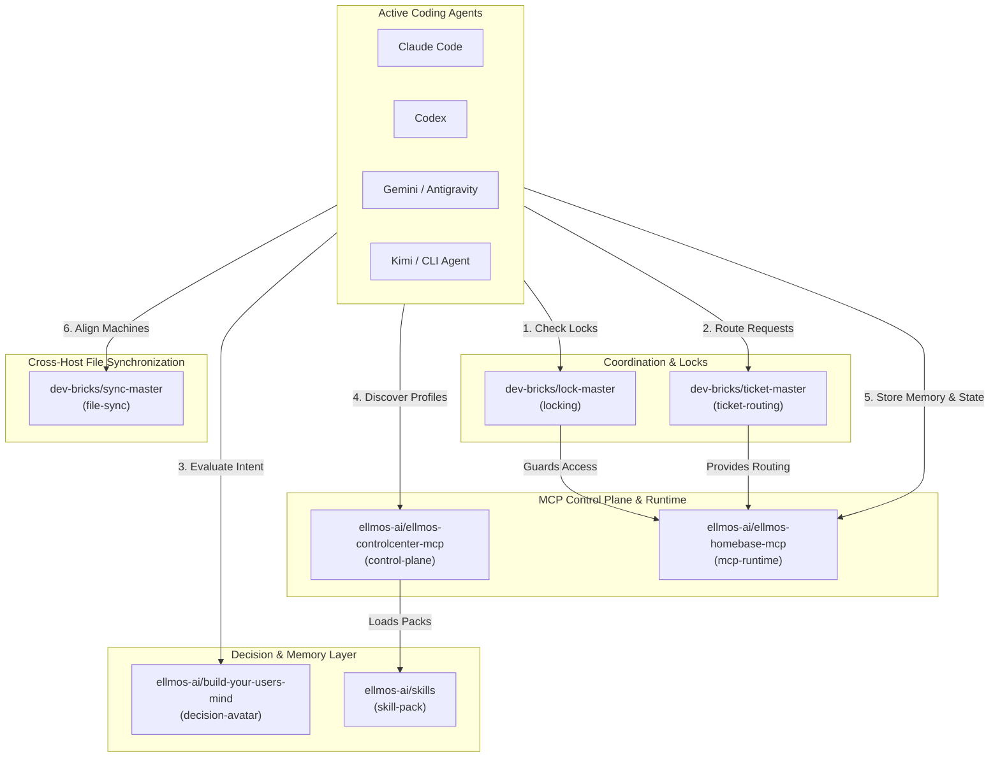
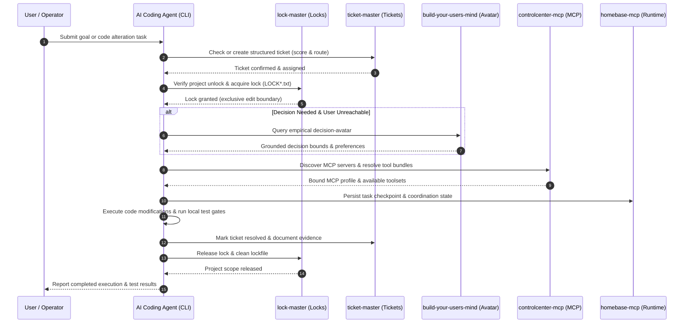

<p align="center">
  <a href="https://github.com/ellmos-ai/agent-ops-stack"></a>
  <a href="https://github.com/ellmos-ai/agent-ops-stack"></a>
  <a href="https://github.com/ellmos-ai/agent-ops-stack/actions/workflows/ci.yml"></a>
  <a href="tests/"></a>
  <a href="agent-ops.manifest.json"></a>
  
  
  
  
  <a href="LICENSE"></a>
  <a href="https://github.com/ellmos-ai"></a>
  <a href="https://github.com/open-bricks"></a>
  <a href="llms.txt"></a>
</p>

# agent-ops-stack

**🇩🇪 [Deutsche Version](README_de.md)**

A manifest-driven composition of the local **agent-ops** ecosystem: the coordination
layer that lets one or more AI coding agents (Claude Code, Codex, Gemini/Antigravity,
Kimi, or any other CLI agent) collaborate effectively on the same machine without race
conditions, know where to route tasks, make grounded decisions when the human operator
is away, and align cross-device workflows safely.

This repository is composition and documentation, not monolithic source code: it lists
seven focused, independently maintained modules in [`agent-ops.manifest.json`](agent-ops.manifest.json)
and provides a thin installer ([`install.sh`](install.sh)) that clones and reports their
wiring. See [ellmos-ai/stacks](https://github.com/ellmos-ai/stacks) for the shared stack
manifest schema specification and ecosystem catalog.

Machine-readable context for LLMs and agentic tools: [`llms.txt`](llms.txt).

> [!NOTE]
> **AI Agent & LLM Context**: This repository provides structured machine-readable context via [`llms.txt`](llms.txt). Autonomous CLI agents (Claude Code, Codex, Gemini/Antigravity, Kimi) can parse this manifest-driven composition to understand local coordination, locking, ticket routing, user-decision avatars, and MCP server control planes.

---

### Quick Navigation

1. [Architecture & Overview](#1-architecture--overview)
2. [What is Agent-Ops?](#2-what-is-agent-ops)
3. [Composed Modules (The 7 Pillars)](#3-composed-modules-the-7-pillars)
4. [System Architecture Flowchart](#4-system-architecture-flowchart)
5. [Multi-Agent Operational Lifecycle Sequence](#5-multi-agent-operational-lifecycle-sequence)
6. [Governance & Runtime Invariants](#6-governance--runtime-invariants)
7. [How an Agent Uses This Stack](#7-how-an-agent-uses-this-stack)
8. [Quickstart & Installation](#8-quickstart--installation)
9. [Manifest Schema Specification](#9-manifest-schema-specification)
10. [Sibling Ecosystem & Cross-Integration Matrix](#10-sibling-ecosystem--cross-integration-matrix)
11. [Search & Disambiguation](#11-search--disambiguation)
12. [Security & Verification](#12-security--verification)
13. [License](#13-license)
14. [Liability / Haftung](#14-liability--haftung)

---

## 1. Architecture & Overview

When multiple autonomous or interactive CLI coding agents operate simultaneously on a
developer's machine, standard file systems lack native concurrency controls, shared task
registries, and cross-session memory. `agent-ops-stack` packages the essential local
operational tooling into a coherent, declarative stack:

| Dimension | Specification |
|:---|:---|
| **Manifest Schema** | `ellmos-stack-manifest-v1` ([`agent-ops.manifest.json`](agent-ops.manifest.json)) |
| **Composed Pillars** | 7 specialized modules across coordination, sync, decisions, skills, and MCP |
| **Network Footprint** | 100% Local-First & Zero Egress (zero external telemetry or remote tracking) |
| **Privilege Model** | Unprivileged User-Mode (Non-Elevation; zero root/admin requirements) |
| **Target Runtime** | Linux, macOS, and Microsoft Windows (cross-platform OS parity) |
| **Agent Support** | Claude Code, OpenAI Codex, Google Antigravity / Gemini, Moonshot Kimi, custom CLI agents |

```
your AI coding agent
├── MCP access (talks to these directly via stdio)
│   ├── controlcenter-mcp   → control-plane (consumes: skill-pack)
│   └── homebase-mcp        → mcp-runtime, memory-facade, task-facade (consumes: locking, ticket-routing)
└── file-/protocol-based conventions (agent reads & follows directly)
    ├── ticket-master           → ticket-routing
    ├── lock-master             → locking
    ├── sync-master             → file-sync
    ├── build-your-users-mind   → decision-avatar (consumes: interaction-logs)
    └── skills                  → skill-pack
```

---

## 2. What is Agent-Ops?

Any AI coding agent operating on the user's local system repeatedly encounters the same
handful of questions before touching project files:
- *Is another agent or automation currently modifying this workspace?*
- *Where should a discovered bug, change request, or subtask be recorded and routed?*
- *What would the human operator decide when an ambiguous architectural trade-off arises while they are away?*
- *What reusable skills, patterns, or workflows exist, and how should local MCP servers be bundled?*
- *How are file updates coordinated across multiple devices without corrupting local Git states?*

`agent-ops-stack` solves these challenges through seven focused, composable modules rather
than a heavy monolithic framework. Each component is independently useful and versioned,
yet harmonized through declarative wiring.

---

## 3. Composed Modules (The 7 Pillars)

| Module | Role | Provides | Consumes | Repository |
|:---|:---|:---|:---|:---|
| **ticket-master** | Cross-platform, multi-provider workflow engine: captures problem descriptions, scores priority, and routes tickets to appropriate projects or delegates | `ticket-routing` | — | [dev-bricks/ticket-master](https://github.com/dev-bricks/ticket-master) |
| **lock-master** | Zero-dependency, config-driven file lock system (`LOCK*.txt`): signals active project usage to prevent concurrent editing collisions | `locking` | — | [dev-bricks/lock-master](https://github.com/dev-bricks/lock-master) |
| **sync-master** | Serverless file-sync coordination: slot rules and gated daily sync rituals across multi-machine setups | `file-sync` | — | [dev-bricks/sync-master](https://github.com/dev-bricks/sync-master) |
| **build-your-users-mind** | Empirical user decision-avatar: constructs a theory-of-mind model from interaction history to guide autonomous decisions in operator absence | `decision-avatar` | `interaction-logs` | [ellmos-ai/build-your-users-mind](https://github.com/ellmos-ai/build-your-users-mind) |
| **skills** | Portable AI skill library in Anthropic `SKILL.md` format: standalone process skills, developer workflows, and utility toolchains | `skill-pack` | — | [ellmos-ai/skills](https://github.com/ellmos-ai/skills) |
| **controlcenter-mcp** | MCP control plane: discovers local MCP servers, reads profile files, resolves capability bundles, and recommends task-specific tool configurations | `control-plane` | `skill-pack` | [ellmos-ai/ellmos-controlcenter-mcp](https://github.com/ellmos-ai/ellmos-controlcenter-mcp) |
| **homebase-mcp** | Local-first MCP server for shared memory, knowledge, routing, swarm patterns, and task facade over canonical local stores | `mcp-runtime`, `memory-facade`, `task-facade` | `locking`, `ticket-routing` | [ellmos-ai/ellmos-homebase-mcp](https://github.com/ellmos-ai/ellmos-homebase-mcp) |

---

## 4. System Architecture Flowchart

The following interactive Mermaid flowchart illustrates how the seven modules organize
into functional operational layers around the active coding agents:



---

## 5. Multi-Agent Operational Lifecycle Sequence

The sequence below depicts the end-to-end execution flow of an AI coding agent performing
a task within the `agent-ops-stack` operational harness:



---

## 6. Governance & Runtime Invariants

The `agent-ops-stack` architecture operates under ten immutable governance and safety
invariants to protect project trees from concurrent corruption and unbounded actions:

| ID | Governance Invariant | Operational Rule | Failure State Guarantee |
|:---:|:---|:---|:---|
| **01** | **100% Local-First & Zero Egress** | All coordination, manifests, and tooling execute strictly offline and locally. | Zero telemetry egress or external API transmission. |
| **02** | **Non-Elevation User-Mode** | Every script, installer, and agent routine runs under unprivileged user rights. | Elevation to administrative or root privileges is never requested. |
| **03** | **Fail-Closed File Lock Integrity** | Agents must check and honor `lock-master` `LOCK*.txt` before write actions. | If a lock is active, mutating actions halt immediately. |
| **04** | **Structured Ticket Routing** | Open tasks and bugs must be dispatched via `ticket-master` protocols. | Prevents silent or untracked changes across workspaces. |
| **05** | **Empirical Decision-Avatar Fallback** | Unclear design choices during operator absence consult `build-your-users-mind`. | Prevents speculative deviations and unapproved architectural drifts. |
| **06** | **Deterministic Manifest Blueprint** | Composition is strictly governed by `agent-ops.manifest.json`. | Zero implicit dependencies; installer is purely declarative. |
| **07** | **Immutable Release-Tag Pinning** | Manifest sources reference immutable release tags (`v1.11.3`, `v2026.09.03`). | Eliminates upstream drift and unexpected breakages. |
| **08** | **Sandboxed Installer Boundary** | `install.sh` clones modules exclusively into gitignored `./modules/`. | Zero mutation of user system or agent host configurations. |
| **09** | **Cross-Device Slot-Gated Sync** | `sync-master` assigns dedicated machine slots for multi-host alignment. | Prevents split-brain sync collisions and cloud race states. |
| **10** | **Multi-OS Platform Parity** | Workflows and verification are validated across Linux, Windows, and macOS. | Identical coordination behavior regardless of host OS. |

---

## 7. How an Agent Uses This Stack

When entering an unfamiliar workspace or starting an operational session, an agent follows
this structured procedure:

1. **Before modifying any file:** Check for an active `LOCK*.txt` in the target project via `lock-master`. If locked, treat the scope as read-only.
2. **Permissions & scopes:** If the project specifies a lock-master permission profile, evaluate the planned operation against declared policies.
3. **Decisions under uncertainty:** If the user is unavailable and an architectural judgment call is needed, query `build-your-users-mind` for empirical guidance.
4. **Task logging & routing:** File defects, proposed enhancements, or delegate tasks through `ticket-master` to ensure traceability.
5. **Skill selection & MCP configuration:** Consult `skills` for standardized workflows; use `controlcenter-mcp` to select tool bundles; persist state via `homebase-mcp`.
6. **Multi-device alignment:** On multi-machine setups, adhere to `sync-master` host-slot conventions and daily synchronization routines before pushing changes.

> [!TIP]
> **Multi-Agent Coordination Best Practice**: Always run `lock-master` checks before starting code modifications in any shared codebase, and use `ticket-master` for routing unresolved tasks across agent sessions or to the user.

---

## 8. Quickstart & Installation

Clone `agent-ops-stack` and execute the installer script to inspect or set up local modules:

```bash
# 1. Clone the composition repository
git clone https://github.com/ellmos-ai/agent-ops-stack.git
cd agent-ops-stack

# 2. Run the declarative installer (clones modules into ./modules/)
./install.sh

# 3. Optional: specify a custom target directory
./install.sh custom-modules-dir
```

`install.sh` reads [`agent-ops.manifest.json`](agent-ops.manifest.json), clones the seven
repositories, and displays a comprehensive wiring summary of all provided and consumed
capabilities. It makes no destructive system changes and sets no environment variables.

---

## 9. Manifest Schema Specification

[`agent-ops.manifest.json`](agent-ops.manifest.json) implements the `ellmos-stack-manifest-v1`
specification:

```json
{
  "schema": "ellmos-stack-manifest-v1",
  "name": "agent-ops-stack",
  "description": "Local-first coordination layer for one or more CLI coding agents...",
  "modules": [
    {
      "name": "ticket-master",
      "source": { "type": "github", "repo": "dev-bricks/ticket-master", "ref": "v1.11.3" },
      "kind": "coordination",
      "boundaries": { "net": "none", "paths": ["./"], "tools": [] },
      "wiring": { "provides": ["ticket-routing"], "consumes": [] }
    }
  ]
}
```

- `schema`: Identifies specification version (`ellmos-stack-manifest-v1`).
- `modules`: List of component specifications with git source, kind, and boundaries.
- `boundaries`: Hard limits on network access, path scoping, and exposed tool patterns.
- `wiring`: Declares exported capabilities (`provides`) and dependencies (`consumes`).

---

## 10. Sibling Ecosystem & Cross-Integration Matrix

`agent-ops-stack` serves as the central coordination hub connecting tooling across the
`ellmos-ai`, `dev-bricks`, and `open-bricks` ecosystems:

| Repository | Organization | Ecosystem Role & Integration |
|:---|:---|:---|
| [dev-bricks/ticket-master](https://github.com/dev-bricks/ticket-master) | `dev-bricks` | Position-0 issue routing, ticket scoring, and task delegation |
| [dev-bricks/lock-master](https://github.com/dev-bricks/lock-master) | `dev-bricks` | File locking (`LOCK*.txt`), rights evaluation, and concurrency guards |
| [dev-bricks/sync-master](https://github.com/dev-bricks/sync-master) | `dev-bricks` | Cross-machine slot synchronization and gated daily routines |
| [ellmos-ai/build-your-users-mind](https://github.com/ellmos-ai/build-your-users-mind) | `ellmos-ai` | Empirical decision-avatar model derived from interaction history |
| [ellmos-ai/skills](https://github.com/ellmos-ai/skills) | `ellmos-ai` | Portable AI skill library in standardized `SKILL.md` format |
| [ellmos-ai/ellmos-controlcenter-mcp](https://github.com/ellmos-ai/ellmos-controlcenter-mcp) | `ellmos-ai` | MCP control plane, server discovery, and capability bundles |
| [ellmos-ai/ellmos-homebase-mcp](https://github.com/ellmos-ai/ellmos-homebase-mcp) | `ellmos-ai` | Shared state, memory facade, and multi-agent coordination runtime |
| [ellmos-ai/stacks](https://github.com/ellmos-ai/stacks) | `ellmos-ai` | Shared manifest schemas, validation utilities, and ecosystem stack catalog |
| [ellmos-ai/convergence-reconciler](https://github.com/ellmos-ai/convergence-reconciler) | `ellmos-ai` | Reciprocal code evaluation, variant transplantation, and Pareto fitness |
| [ellmos-ai/ellmos-chat](https://github.com/ellmos-ai/ellmos-chat) | `ellmos-ai` | Local-first chat and agent orchestration interface |
| [dev-bricks/CareCenter-for-Codex](https://github.com/dev-bricks/CareCenter-for-Codex) | `dev-bricks` | Background maintenance, health monitoring, and SQLite optimization |
| [open-bricks/open-bricks](https://github.com/open-bricks/open-bricks) | `open-bricks` | Umbrella open-source developer tooling and standards collective |

---

## 11. Search & Disambiguation

- **Canonical Identity**: `ellmos-ai/agent-ops-stack` is a declarative, local-first multi-agent coordination stack composing file locking, ticket routing, user-decision avatars, skills, and an MCP control plane.
- **Disambiguation**: Unrelated to cloud SaaS observability platforms (such as AgentOps.ai), generic AgentStack scaffolding, or remote LLMOps telemetry servers.
- **Keywords & Search Anchors**: `ellmos-ai agent-ops-stack`, `local CLI agent coordination stack`, `MCP control plane for coding agents`, `manifest-driven agent ops stack`, `lock-master ticket-master sync-master stack`.

---

## 12. Security & Verification

`agent-ops-stack` enforces strict integrity verification through static linting and
automated parity test suites:

```bash
# 1. Run automated metadata, schema, and parity contract tests
pytest -v

# 2. Validate linter standards
ruff check .

# 3. Check shell script syntax
bash -n install.sh

# 4. Validate manifest JSON
python -c "import json; json.load(open('agent-ops.manifest.json', encoding='utf-8'))"
```

For complete vulnerability reporting guidelines and response timelines, consult [`SECURITY.md`](SECURITY.md).

---

## 13. License

This repository is distributed under the permissive **MIT License**. See [`LICENSE`](LICENSE) for details. Each composed module remains under its respective open-source license.

---

## 14. Liability / Haftung

Dieses Projekt ist eine **unentgeltliche Open-Source-Schenkung** im Sinne der §§ 516 ff. BGB. Die Haftung des Urhebers ist gemäß **§ 521 BGB** auf **Vorsatz und grobe Fahrlässigkeit** beschränkt. Die komponierten Module unterliegen jeweils ihrer eigenen Lizenz (siehe verlinkte Repositories).
