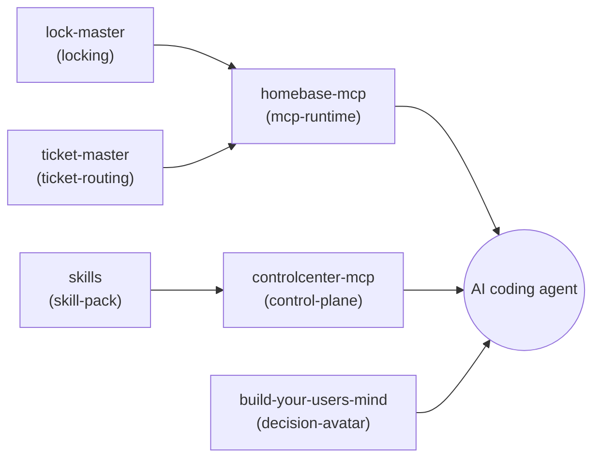

# agent-ops-stack

**🇩🇪 [Deutsche Version](README_de.md)**

A manifest-driven composition of the local **agent-ops** ecosystem: the coordination
layer that lets one or more AI coding agents (Claude, Codex, Gemini/agy, Kimi, or any
other CLI agent) work on the same user's machine without stepping on each other, know
where to route problems, and act sensibly when the user isn't around to ask.

This repository is composition and documentation, not source code: it lists six
existing, independently publishable modules in [`agent-ops.manifest.json`](agent-ops.manifest.json)
and ships a thin installer ([`install.sh`](install.sh)) that clones and wires them.
No module's code is copied here. See [ellmos-ai/stacks](https://github.com/ellmos-ai/stacks)
for the shared manifest schema and the catalog of every stack in the ellmos-ai family.

Machine-readable context for LLMs and agentic coding tools: [`llms.txt`](llms.txt).

## What is Agent-Ops?

Any AI coding agent operating on `<USER>`'s local system repeatedly needs answers to
the same handful of questions before it touches anything: *Is another agent already
working in this project right now? Where do I file a bug or change request so it gets
routed to the right place? What would `<USER>` decide here if they aren't reachable?
What shared skills/workflows already exist for this kind of task, and how do I manage
the local MCP tool surface those skills might need?*

Agent-Ops answers those questions with six small, focused modules instead of one large
framework — each independently useful, composed here into one stack.

## Modules

| Module | Role | Provides | Repository |
|--------|------|----------|-------------|
| **ticket-master** | Cross-platform, multi-provider workflow/operating mode: `<USER>` types a problem into one open agent session ("Position 0"); the agent captures it as a structured ticket, scores it, and routes it to the right project or delegate | `ticket-routing` | [dev-bricks/ticket-master](https://github.com/dev-bricks/ticket-master) |
| **lock-master** | Portable, zero-dependency, config-driven file-lock system (`LOCK*.txt`) for multi-agent coordination — signals which project/component is currently in use so no other agent or automation touches it concurrently | `locking` | [dev-bricks/lock-master](https://github.com/dev-bricks/lock-master) |
| **build-your-users-mind** | Builds an empirical, self-improving theory-of-mind model of `<USER>` from `<AGENT>`'s own interaction logs, so an agent can predict what `<USER>` would decide and act in their spirit while they're away | `decision-avatar` | [ellmos-ai/build-your-users-mind](https://github.com/ellmos-ai/build-your-users-mind) |
| **skills** | Portable AI skill library in Anthropic-compatible `SKILL.md` format: standalone process skills, dev workflows, and utility tools any agent runtime can install | `skill-pack` | [ellmos-ai/skills](https://github.com/ellmos-ai/skills) |
| **controlcenter-mcp** | MCP control plane: discovers local MCP servers, reads MCP profile files, groups servers into capability bundles, recommends a profile for a task | `control-plane` | [ellmos-ai/ellmos-controlcenter-mcp](https://github.com/ellmos-ai/ellmos-controlcenter-mcp) |
| **homebase-mcp** | Local-first MCP server for memory, knowledge, routing, swarm patterns, and persistent state — the module can also front an existing local memory/task store as a facade instead of its own bundled database | `mcp-runtime`, `memory-facade`, `task-facade` | [ellmos-ai/ellmos-homebase-mcp](https://github.com/ellmos-ai/ellmos-homebase-mcp) |

## How the modules wire together



`homebase-mcp` and `controlcenter-mcp` are the two modules an agent talks to directly
(as MCP servers); `ticket-master`, `lock-master`, `build-your-users-mind`, and `skills`
are file-/protocol-based conventions the agent reads and follows directly, and which
`homebase-mcp`/`controlcenter-mcp` can optionally front as MCP tool calls.

## How an agent uses this stack

1. **Before changing anything in a project:** check for an active `LOCK*.txt`
   (lock-master). Respect it — do not modify a locked scope.
2. **Rights, if declared:** if a project defines a lock-master permissions file,
   evaluate the intended action against it before proceeding.
3. **Decision under uncertainty:** if `<USER>` is unreachable and a judgment call is
   needed, consult the decision-avatar (build-your-users-mind) instead of guessing.
4. **Bugs, change requests, or open questions:** file them through ticket-master so
   they reach the right project and get routed to a suitable agent/delegate.
5. **Tools and shared knowledge:** browse the shared skill-pack (skills) for an
   existing workflow before improvising one; use controlcenter-mcp to pick the right
   MCP profile/bundle for the task; use homebase-mcp for shared memory/task access
   where the local setup wires it to a canonical store.

## Installing

```bash
git clone https://github.com/ellmos-ai/agent-ops-stack.git
cd agent-ops-stack
./install.sh            # clones all six modules into ./modules/
```

`install.sh` only reads [`agent-ops.manifest.json`](agent-ops.manifest.json), clones
each listed module, and prints a wiring summary — it does not register MCP servers
with your agent's config or deploy skills into your skill directory. Each module's own
README documents that module-specific setup step (e.g. registering `ellmos-homebase-mcp`
or `ellmos-controlcenter-mcp` with your MCP host, or copying a skill folder into
`~/.claude/skills/`). This keeps `agent-ops-stack` itself free of per-agent
configuration assumptions.

## Manifest schema

`agent-ops.manifest.json` follows `ellmos-stack-manifest-v1`, documented in
[ellmos-ai/stacks](https://github.com/ellmos-ai/stacks/blob/main/docs/manifest-schema.md).
Adding a module means adding one entry to that file — no installer code changes.

## Why "agent-ops"

This composes the **local, per-user power layer** for CLI coding agents (coordination,
memory, decisions, skills, MCP control plane) — distinct from a hosted assistant
product (chat UI, RAG, auth) or a server-side research-automation stack such as
[ellmos-ai/ellmos-stack](https://github.com/ellmos-ai/ellmos-stack). It follows the
same "installation is the blueprint" manifest principle used elsewhere in the
`ellmos-ai` ecosystem.

## License

MIT

---

## Haftung / Liability

Dieses Projekt ist eine **unentgeltliche Open-Source-Schenkung** im Sinne der §§ 516 ff. BGB. Die Haftung des Urhebers ist gemäß **§ 521 BGB** auf **Vorsatz und grobe Fahrlässigkeit** beschränkt. Die komponierten Module unterliegen jeweils ihrer eigenen Lizenz (siehe verlinkte Repositories).
