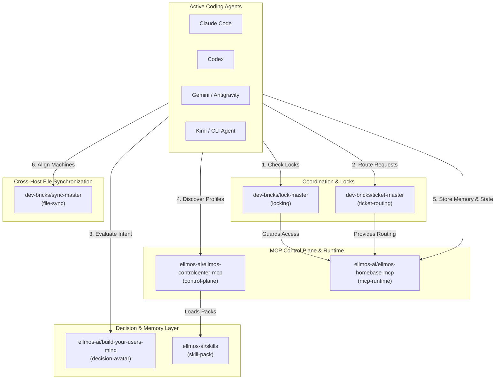
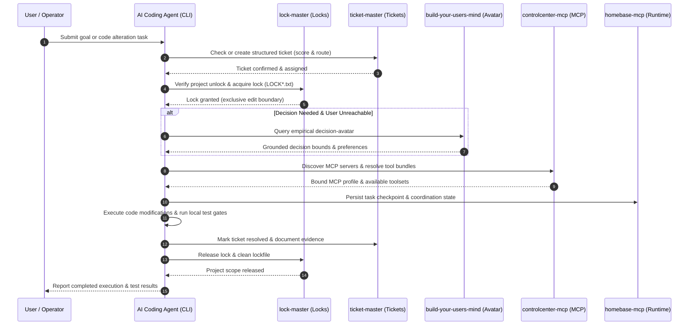
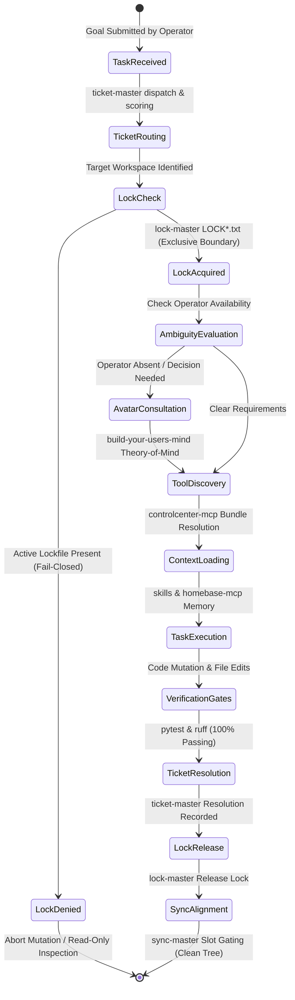

<p align="center">
  <a href="https://github.com/ellmos-ai/agent-ops-stack"></a>
  <a href="https://github.com/ellmos-ai/agent-ops-stack"></a>
  <a href="https://github.com/ellmos-ai/agent-ops-stack/actions/workflows/ci.yml"></a>
  <a href="tests/"></a>
  <a href="agent-ops.manifest.json"></a>
  
  
  
  
  <a href="SECURITY.md"></a>
  <a href="CONTRIBUTING.md"></a>
  <a href="THIRD_PARTY_LICENSES.md"></a>
  <a href="MARKETING-LOG.txt"></a>
  <a href="https://github.com/astral-sh/ruff"></a>
  <a href="LICENSE"></a>
  <a href="NOTICE"></a>
  <a href="https://github.com/ellmos-ai"></a>
  <a href="https://github.com/open-bricks"></a>
  <a href="llms.txt"></a>
</p>

# agent-ops-stack

**🇩🇪 [Deutsche Version](README_de.md)**

A manifest-driven composition of the local **agent-ops** ecosystem: the coordination
layer that lets one or more AI coding agents (Claude Code, Codex, Gemini/Antigravity,
Kimi, or any other CLI agent) collaborate effectively on the same machine without race
conditions, know where to route tasks, make grounded decisions when the human operator
is away, and align cross-device workflows safely.

This repository is composition and documentation, not monolithic source code: it lists
seven focused, independently maintained modules in [`agent-ops.manifest.json`](agent-ops.manifest.json)
and provides a thin installer ([`install.sh`](install.sh)) that clones and reports their
wiring. See [ellmos-ai/stacks](https://github.com/ellmos-ai/stacks) for the shared stack
manifest schema specification and ecosystem catalog.

Machine-readable context for LLMs and agentic tools: [`llms.txt`](llms.txt).

> [!NOTE]
> **AI Agent & LLM Context**: This repository provides structured machine-readable context via [`llms.txt`](llms.txt). Autonomous CLI agents (Claude Code, Codex, Gemini/Antigravity, Kimi) can parse this manifest-driven composition to understand local coordination, locking, ticket routing, user-decision avatars, and MCP server control planes.

---

### Quick Navigation

1. [Overview & Architecture](#1-overview--architecture)
2. [What is Agent-Ops?](#2-what-is-agent-ops)
3. [Target Personas & Discoverability](#3-target-personas--discoverability)
4. [Comparative Matrix vs. Alternatives](#4-comparative-matrix-vs-alternatives)
5. [Composed Modules (The 7 Pillars)](#5-composed-modules-the-7-pillars)
6. [System Architecture Flowchart](#6-system-architecture-flowchart)
7. [Multi-Agent Operational Lifecycle Sequence](#7-multi-agent-operational-lifecycle-sequence)
8. [Governance & Runtime Invariants](#8-governance--runtime-invariants)
9. [How an Agent Uses This Stack](#9-how-an-agent-uses-this-stack)
10. [Quickstart & Installation](#10-quickstart--installation)
11. [Manifest Schema Specification](#11-manifest-schema-specification)
12. [Sibling Ecosystem & Cross-Integration Matrix](#12-sibling-ecosystem--cross-integration-matrix)
13. [Search, SEO & Disambiguation](#13-search-seo--disambiguation)
14. [Security Model & Threat Mitigation](#14-security-model--threat-mitigation)
15. [Third-Party Licenses & Transparency](#15-third-party-licenses--transparency)
16. [Verification & Automated Test Suite](#16-verification--automated-test-suite)
17. [Security Policy & SLAs](#17-security-policy--slas)
18. [License & Liability / Haftung](#18-license--liability--haftung)

---

<a id="1-overview--architecture"></a>
<a id="overview--architecture"></a>
<a id="1-ueberblick--architektur"></a>
<a id="ueberblick--architektur"></a>
<a id="1-architecture--overview"></a>
<a id="architecture--overview"></a>
## 1. Overview & Architecture

When multiple autonomous or interactive CLI coding agents operate simultaneously on a
developer's machine, standard file systems lack native concurrency controls, shared task
registries, and cross-session memory. `agent-ops-stack` packages the essential local
operational tooling into a coherent, declarative stack:

| Dimension | Specification |
|:---|:---|
| **Manifest Schema** | `ellmos-stack-manifest-v1` ([`agent-ops.manifest.json`](agent-ops.manifest.json)) |
| **Composed Pillars** | 7 specialized modules across coordination, sync, decisions, skills, and MCP |
| **Network Footprint** | 100% Local-First & Zero Egress (zero external telemetry or remote tracking) |
| **Privilege Model** | Unprivileged User-Mode (Non-Elevation; zero root/admin requirements) |
| **Target Runtime** | Linux, macOS, and Microsoft Windows (cross-platform OS parity) |
| **Agent Support** | Claude Code, OpenAI Codex, Google Antigravity / Gemini, Moonshot Kimi, custom CLI agents |

```
your AI coding agent
├── MCP access (talks to these directly via stdio)
│   ├── controlcenter-mcp   → control-plane (consumes: skill-pack)
│   └── homebase-mcp        → mcp-runtime, memory-facade, task-facade (consumes: locking, ticket-routing)
└── file-/protocol-based conventions (agent reads & follows directly)
    ├── ticket-master           → ticket-routing
    ├── lock-master             → locking
    ├── sync-master             → file-sync
    ├── build-your-users-mind   → decision-avatar (consumes: interaction-logs)
    └── skills                  → skill-pack
```

---

<a id="2-what-is-agent-ops"></a>
<a id="what-is-agent-ops"></a>
<a id="2-was-ist-agent-ops"></a>
<a id="was-ist-agent-ops"></a>
## 2. What is Agent-Ops?

Any AI coding agent operating on the user's local system repeatedly encounters the same
handful of questions before touching project files:
- *Is another agent or automation currently modifying this workspace?*
- *Where should a discovered bug, change request, or subtask be recorded and routed?*
- *What would the human operator decide when an ambiguous architectural trade-off arises while they are away?*
- *What reusable skills, patterns, or workflows exist, and how should local MCP servers be bundled?*
- *How are file updates coordinated across multiple devices without corrupting local Git states?*

`agent-ops-stack` solves these challenges through seven focused, composable modules rather
than a heavy monolithic framework. Each component is independently useful and versioned,
yet harmonized through declarative wiring.

---

<a id="3-target-personas--discoverability"></a>
<a id="target-personas--discoverability"></a>
<a id="3-zielgruppen--auffindbarkeit"></a>
<a id="zielgruppen--auffindbarkeit"></a>
## 3. Target Personas & Discoverability

`agent-ops-stack` is purposefully engineered for four key stakeholder personas across autonomous engineering and enterprise toolchains:

- **`[PERSONA-01]` Autonomous AI Agent Framework & Multi-Agent Swarm Engineers**:
  Engineers deploying multiple autonomous CLI coding agents (Claude Code, OpenAI Codex, Google Antigravity / Gemini, Moonshot Kimi) on shared local workspaces who require bulletproof, fail-closed file locking (`lock-master`) and structured ticket routing (`ticket-master`) to eliminate race conditions and conflicting write edits.
- **`[PERSONA-02]` Multi-Host & Edge Infrastructure Systems Engineers**:
  Developers working interchangeably across multiple workstations, laptops, and remote servers who require slot-gated synchronization (`sync-master`) to coordinate project files safely without Git index corruption, split-brain merge collisions, or cloud storage lockouts.
- **`[PERSONA-03]` Solo Developers & Tool Builders**:
  Individual programmers needing a lightweight, non-monolithic harness that manages ticket backlogs, captures task requirements, and provides an empirical decision avatar (`build-your-users-mind`) that answers ambiguous architectural questions when the human operator is away.
- **`[PERSONA-04]` Enterprise Tooling, Safety & Governance Compliance Officers**:
  Compliance leaders mandating 100% offline, local-first operations with zero external network egress, unprivileged user-mode execution (`RunAsInvoker`), auditable third-party license inventories, and formal 48h vulnerability response SLAs.

### High-Intent Search Queries & Discovery Keywords

| Query Type | English Intent Target | German Intent Target |
|:---|:---|:---|
| **Primary Architectural** | `local-first multi-agent coordination stack` | `lokaler Multi-Agenten Koordinations-Stack` |
| **Concurrency & Locks** | `CLI coding agent file locking and ticket routing` | `Dateisperren und Ticket-Routing für KI Coding Agenten` |
| **Agent Interoperability** | `Claude Code Codex Gemini Kimi local coordination` | `lokale Koordination Claude Codex Antigravity Kimi` |
| **Control Plane & MCP** | `MCP control plane for local AI agents` | `MCP Steuerebene für lokale Entwickler-Agenten` |
| **Zero Egress & Safety** | `offline zero-egress agent harness` | `Zero-Egress Multi-Agenten Kollisionsschutz` |
| **Manifest Composition** | `declarative agent ops manifest schema` | `deklaratives Agent-Ops Manifest Schema` |

---

<a id="4-comparative-matrix-vs-alternatives"></a>
<a id="comparative-matrix-vs-alternatives"></a>
<a id="4-vergleichsmatrix-gegenueber-alternativen"></a>
<a id="vergleichsmatrix-gegenueber-alternativen"></a>
## 4. Comparative Matrix vs. Alternatives

The table below contrasts `agent-ops-stack` against four common industry alternatives across 10 core architectural and governance dimensions:

1. **Cloud SaaS Observability**: Hosted monitoring and telemetry platforms (e.g. AgentOps.ai, LangSmith, Helicone).
2. **Monolithic Frameworks**: Heavy multi-agent execution runtimes (e.g. AutoGen Studio, CrewAI Enterprise, LangGraph Cloud).
3. **Ad-Hoc Scripts & Worktrees**: Manual Git worktrees, raw bash wrappers, and uncoordinated local shell scripts.
4. **Traditional Message Brokers**: Heavy server daemons (e.g. RabbitMQ, Redis Pub/Sub, Celery).

| Dimension & Invariant | agent-ops-stack | Cloud SaaS Observability | Monolithic Frameworks | Ad-Hoc Scripts / Worktrees | Traditional Brokers |
|:---|:---:|:---:|:---:|:---:|:---:|
| **1. 100% Local-First & Zero Egress** (`INV-LOCAL-01`) | **Yes (Strictly Local)** | No (Cloud Egress Required) | Partial (Often Phone-Home) | Yes (Local Only) | Partial (Network Port Needed) |
| **2. Unprivileged User-Mode** (`INV-USER-02`) | **Yes (`RunAsInvoker`)** | Yes (User-Level API) | Often Needs Daemon / Docker | Yes (Standard User) | No (Daemon / Root Ports) |
| **3. Fail-Closed File Lock Integrity** (`INV-LOCK-03`) | **Yes (`lock-master`)** | No (Observability Only) | Proprietary In-Memory | No (Blind Git Overwrites) | No (Requires External Broker) |
| **4. Structured Ticket & Bug Routing** (`INV-ROUT-04`) | **Yes (`ticket-master`)** | No (Telemetry Traces Only) | Ad-Hoc Task Memory | No (Untracked Modifs) | Message Passing Only |
| **5. Decision-Avatar Theory-of-Mind** (`INV-AVAT-05`) | **Yes (`build-your-users-mind`)**| No (Telemetry Only) | No (Stateless System Prompts) | No (Manual Human Input) | No (Payload Agnostic) |
| **6. Declarative Manifest Blueprint** (`INV-MANI-06`) | **Yes (`ellmos-stack-manifest-v1`)**| Proprietary Cloud Schema | Complex Python DSL Config | None (Hardcoded Paths) | Complex Broker Config |
| **7. Immutable Release-Tag Pinning** (`INV-PIN-07`) | **Yes (Release Tags)** | SaaS Controlled Updates | Fast-Moving Package Drift | No (Unversioned Scripts) | Package Manager Driven |
| **8. Sandboxed Installer Boundary** (`INV-SAND-08`) | **Yes (Isolated `./modules/`)**| Remote Agent Binaries | System-Wide pip / npm Bloat | Ad-Hoc Repository Sprawl | System Service Daemons |
| **9. Cross-Device Slot-Gated Sync** (`INV-SYNC-09`) | **Yes (`sync-master`)** | Cloud Vendor Lock-In | Single-Host Only | High Merge / Cloud Race Risk | Cluster Infrastructure Required |
| **10. 48h Security & Triage SLA** (`INV-SLA-10`) | **Yes (Formal 48h/5d SLA)** | Standard SaaS Terms | Best-Effort Community | No SLA / Unmaintained | Upstream Vendor SLAs |

---

<a id="5-composed-modules-the-7-pillars"></a>
<a id="composed-modules-the-7-pillars"></a>
<a id="5-komponierte-module-die-7-saeulen"></a>
<a id="komponierte-module-die-7-saeulen"></a>
<a id="3-composed-modules-the-7-pillars"></a>
## 5. Composed Modules (The 7 Pillars)

| Module | Role | Provides | Consumes | Repository |
|:---|:---|:---|:---|:---|
| **ticket-master** | Cross-platform, multi-provider workflow engine: captures problem descriptions, scores priority, and routes tickets to appropriate projects or delegates | `ticket-routing` | — | [dev-bricks/ticket-master](https://github.com/dev-bricks/ticket-master) |
| **lock-master** | Zero-dependency, config-driven file lock system (`LOCK*.txt`): signals active project usage to prevent concurrent editing collisions | `locking` | — | [dev-bricks/lock-master](https://github.com/dev-bricks/lock-master) |
| **sync-master** | Serverless file-sync coordination: slot rules and gated daily sync rituals across multi-machine setups | `file-sync` | — | [dev-bricks/sync-master](https://github.com/dev-bricks/sync-master) |
| **build-your-users-mind** | Empirical user decision-avatar: constructs a theory-of-mind model from interaction history to guide autonomous decisions in operator absence | `decision-avatar` | `interaction-logs` | [ellmos-ai/build-your-users-mind](https://github.com/ellmos-ai/build-your-users-mind) |
| **skills** | Portable AI skill library in Anthropic `SKILL.md` format: standalone process skills, developer workflows, and utility toolchains | `skill-pack` | — | [ellmos-ai/skills](https://github.com/ellmos-ai/skills) |
| **controlcenter-mcp** | MCP control plane: discovers local MCP servers, reads profile files, resolves capability bundles, and recommends task-specific tool configurations | `control-plane` | `skill-pack` | [ellmos-ai/ellmos-controlcenter-mcp](https://github.com/ellmos-ai/ellmos-controlcenter-mcp) |
| **homebase-mcp** | Local-first MCP server for shared memory, knowledge, routing, swarm patterns, and task facade over canonical local stores | `mcp-runtime`, `memory-facade`, `task-facade` | `locking`, `ticket-routing` | [ellmos-ai/ellmos-homebase-mcp](https://github.com/ellmos-ai/ellmos-homebase-mcp) |

### Component Interoperability & Communication Wire Protocols

| Protocol / Layer | Modules Involved | Communication Mechanism | Transport & Format | Offline Guarantee |
|:---|:---|:---|:---|:---:|
| **File-Based Lock Semaphore** | `lock-master`, Agents, Scripts | Atomic file creation (`LOCK*.txt`, `LOCK.user.*`) | Local Filesystem POSIX / NTFS | 100% Offline |
| **Declarative Ticket Registry** | `ticket-master`, Agents | Structured ticket files & priority dispatch queues | Markdown / JSON local files | 100% Offline |
| **Model Theory-of-Mind** | `build-your-users-mind`, Agents | Grounded preference vectors & decision heuristics | Local SQLite / JSON files | 100% Offline |
| **MCP Tool Control Plane** | `controlcenter-mcp`, Agents | Dynamic profile resolution & capability bundles | stdio JSON-RPC (Model Context Protocol) | 100% Offline |
| **Runtime Memory & State Facade** | `homebase-mcp`, Agents | Persistent swarm memory, task checkpoints, locks | stdio JSON-RPC over local storage | 100% Offline |
| **Slot-Gated Multi-Host Sync** | `sync-master`, Workstations/Laptops | Host token validation & non-colliding file slots | Local Git & Cloud-Mirror Staging | 100% Offline |
| **Skill Definition Packaging** | `skills`, Agents | Standardized workflow instructions (`SKILL.md`) | YAML Frontmatter + Markdown | 100% Offline |

---

<a id="6-system-architecture-flowchart"></a>
<a id="system-architecture-flowchart"></a>
<a id="6-systemarchitektur-flussdiagramm"></a>
<a id="systemarchitektur-flussdiagramm"></a>
<a id="4-system-architecture-flowchart"></a>
## 6. System Architecture Flowchart

The following interactive Mermaid flowchart illustrates how the seven modules organize
into functional operational layers around the active coding agents:



---

<a id="7-multi-agent-operational-lifecycle-sequence"></a>
<a id="multi-agent-operational-lifecycle-sequence"></a>
<a id="7-multi-agenten-lebenszyklus-sequenz"></a>
<a id="multi-agenten-lebenszyklus-sequenz"></a>
<a id="5-multi-agent-operational-lifecycle-sequence"></a>
## 7. Multi-Agent Operational Lifecycle Sequence

The sequence below depicts the end-to-end execution flow of an AI coding agent performing
a task within the `agent-ops-stack` operational harness:



### Multi-Agent Concurrency & State Machine Lifecycle

The following state machine details how an autonomous coding agent transitions between
deterministic states, enforcing fail-closed lock defense, decision grounding, and test gating:



---

<a id="8-governance--runtime-invariants"></a>
<a id="governance--runtime-invariants"></a>
<a id="8-governance--laufzeit-invarianten"></a>
<a id="governance--laufzeit-invarianten"></a>
<a id="6-governance--runtime-invariants"></a>
## 8. Governance & Runtime Invariants

The `agent-ops-stack` architecture operates under ten immutable governance and safety
invariants to protect project trees from concurrent corruption and unbounded actions:

| ID | Governance Invariant | Operational Rule | Failure State Guarantee |
|:---:|:---|:---|:---|
| **01** | **100% Local-First & Zero Egress** (`INV-LOCAL-01`) | All coordination, manifests, and tooling execute strictly offline and locally. | Zero telemetry egress or external API transmission. |
| **02** | **Non-Elevation User-Mode** (`INV-USER-02`) | Every script, installer, and agent routine runs under unprivileged user rights. | Elevation to administrative or root privileges is never requested. |
| **03** | **Fail-Closed File Lock Integrity** (`INV-LOCK-03`) | Agents must check and honor `lock-master` `LOCK*.txt` before write actions. | If a lock is active, mutating actions halt immediately. |
| **04** | **Structured Ticket Routing** (`INV-ROUT-04`) | Open tasks and bugs must be dispatched via `ticket-master` protocols. | Prevents silent or untracked changes across workspaces. |
| **05** | **Empirical Decision-Avatar Fallback** (`INV-AVAT-05`) | Unclear design choices during operator absence consult `build-your-users-mind`. | Prevents speculative deviations and unapproved architectural drifts. |
| **06** | **Deterministic Manifest Blueprint** (`INV-MANI-06`) | Composition is strictly governed by `agent-ops.manifest.json`. | Zero implicit dependencies; installer is purely declarative. |
| **07** | **Immutable Release-Tag Pinning** (`INV-PIN-07`) | Manifest sources reference immutable release tags (`v1.11.3`, `v2026.09.03`). | Eliminates upstream drift and unexpected breakages. |
| **08** | **Sandboxed Installer Boundary** (`INV-SAND-08`) | `install.sh` clones modules exclusively into gitignored `./modules/`. | Zero mutation of user system or agent host configurations. |
| **09** | **Cross-Device Slot-Gated Sync** (`INV-SYNC-09`) | `sync-master` assigns dedicated machine slots for multi-host alignment. | Prevents split-brain sync collisions and cloud race states. |
| **10** | **48h Security & Triage SLA** (`INV-SLA-10`) | Vulnerabilities and coordination faults adhere to prompt acknowledgment & triage. | Acknowledged within 48h; triage within 5 business days. |

---

<a id="9-how-an-agent-uses-this-stack"></a>
<a id="how-an-agent-uses-this-stack"></a>
<a id="9-wie-ein-agent-diesen-stack-nutzt"></a>
<a id="wie-ein-agent-diesen-stack-nutzt"></a>
<a id="7-how-an-agent-uses-this-stack"></a>
## 9. How an Agent Uses This Stack

When entering an unfamiliar workspace or starting an operational session, an agent follows
this structured procedure:

1. **Before modifying any file:** Check for an active `LOCK*.txt` in the target project via `lock-master`. If locked, treat the scope as read-only.
2. **Permissions & scopes:** If the project specifies a lock-master permission profile, evaluate the planned operation against declared policies.
3. **Decisions under uncertainty:** If the user is unavailable and an architectural judgment call is needed, query `build-your-users-mind` for empirical guidance.
4. **Task logging & routing:** File defects, proposed enhancements, or delegate tasks through `ticket-master` to ensure traceability.
5. **Skill selection & MCP configuration:** Consult `skills` for standardized workflows; use `controlcenter-mcp` to select tool bundles; persist state via `homebase-mcp`.
6. **Multi-device alignment:** On multi-machine setups, adhere to `sync-master` host-slot conventions and daily synchronization routines before pushing changes.

> [!TIP]
> **Multi-Agent Coordination Best Practice**: Always run `lock-master` checks before starting code modifications in any shared codebase, and use `ticket-master` for routing unresolved tasks across agent sessions or to the user.

---

<a id="10-quickstart--installation"></a>
<a id="quickstart--installation"></a>
<a id="10-schnellstart--installation"></a>
<a id="schnellstart--installation"></a>
<a id="8-quickstart--installation"></a>
## 10. Quickstart & Installation

Clone `agent-ops-stack` and execute the installer script to inspect or set up local modules:

```bash
# 1. Clone the composition repository
git clone https://github.com/ellmos-ai/agent-ops-stack.git
cd agent-ops-stack

# 2. Run the declarative installer (clones modules into ./modules/)
./install.sh

# 3. Optional: specify a custom target directory
./install.sh custom-modules-dir
```

`install.sh` reads [`agent-ops.manifest.json`](agent-ops.manifest.json), clones the seven
repositories, and displays a comprehensive wiring summary of all provided and consumed
capabilities. It makes no destructive system changes and sets no environment variables.

---

<a id="11-manifest-schema-specification"></a>
<a id="manifest-schema-specification"></a>
<a id="11-manifest-schema-spezifikation"></a>
<a id="manifest-schema-spezifikation"></a>
<a id="9-manifest-schema-specification"></a>
## 11. Manifest Schema Specification

[`agent-ops.manifest.json`](agent-ops.manifest.json) implements the `ellmos-stack-manifest-v1`
specification:

```json
{
  "schema": "ellmos-stack-manifest-v1",
  "name": "agent-ops-stack",
  "description": "Local-first coordination layer for one or more CLI coding agents...",
  "modules": [
    {
      "name": "ticket-master",
      "source": { "type": "github", "repo": "dev-bricks/ticket-master", "ref": "v1.11.3" },
      "kind": "coordination",
      "boundaries": { "net": "none", "paths": ["./"], "tools": [] },
      "wiring": { "provides": ["ticket-routing"], "consumes": [] }
    }
  ]
}
```

- `schema`: Identifies specification version (`ellmos-stack-manifest-v1`).
- `modules`: List of component specifications with git source, kind, and boundaries.
- `boundaries`: Hard limits on network access, path scoping, and exposed tool patterns.
- `wiring`: Declares exported capabilities (`provides`) and dependencies (`consumes`).

---

<a id="12-sibling-ecosystem--cross-integration-matrix"></a>
<a id="sibling-ecosystem--cross-integration-matrix"></a>
<a id="12-geschwister-oekosystem--integrationsmatrix"></a>
<a id="geschwister-oekosystem--integrationsmatrix"></a>
<a id="10-sibling-ecosystem--cross-integration-matrix"></a>
## 12. Sibling Ecosystem & Cross-Integration Matrix

`agent-ops-stack` serves as the central coordination hub connecting tooling across the
`ellmos-ai`, `dev-bricks`, and `open-bricks` ecosystems:

| Repository | Organization | Ecosystem Role & Integration |
|:---|:---|:---|
| [dev-bricks/ticket-master](https://github.com/dev-bricks/ticket-master) | `dev-bricks` | Position-0 issue routing, ticket scoring, and task delegation |
| [dev-bricks/lock-master](https://github.com/dev-bricks/lock-master) | `dev-bricks` | File locking (`LOCK*.txt`), rights evaluation, and concurrency guards |
| [dev-bricks/sync-master](https://github.com/dev-bricks/sync-master) | `dev-bricks` | Cross-machine slot synchronization and gated daily routines |
| [ellmos-ai/build-your-users-mind](https://github.com/ellmos-ai/build-your-users-mind) | `ellmos-ai` | Empirical decision-avatar model derived from interaction history |
| [ellmos-ai/skills](https://github.com/ellmos-ai/skills) | `ellmos-ai` | Portable AI skill library in standardized `SKILL.md` format |
| [ellmos-ai/ellmos-controlcenter-mcp](https://github.com/ellmos-ai/ellmos-controlcenter-mcp) | `ellmos-ai` | MCP control plane, server discovery, and capability bundles |
| [ellmos-ai/ellmos-homebase-mcp](https://github.com/ellmos-ai/ellmos-homebase-mcp) | `ellmos-ai` | Shared state, memory facade, and multi-agent coordination runtime |
| [ellmos-ai/stacks](https://github.com/ellmos-ai/stacks) | `ellmos-ai` | Shared manifest schemas, validation utilities, and ecosystem stack catalog |
| [ellmos-ai/convergence-reconciler](https://github.com/ellmos-ai/convergence-reconciler) | `ellmos-ai` | Reciprocal code evaluation, variant transplantation, and Pareto fitness |
| [ellmos-ai/ellmos-chat](https://github.com/ellmos-ai/ellmos-chat) | `ellmos-ai` | Local-first chat and agent orchestration interface |
| [dev-bricks/CareCenter-for-Codex](https://github.com/dev-bricks/CareCenter-for-Codex) | `dev-bricks` | Background maintenance, health monitoring, and SQLite optimization |
| [open-bricks/open-bricks](https://github.com/open-bricks/open-bricks) | `open-bricks` | Umbrella open-source developer tooling and standards collective |

---

<a id="13-search-seo--disambiguation"></a>
<a id="search-seo--disambiguation"></a>
<a id="13-suche-seo--begriffsklaerung"></a>
<a id="suche-seo--begriffsklaerung"></a>
<a id="11-search--disambiguation"></a>
## 13. Search, SEO & Disambiguation

- **Canonical Identity**: `ellmos-ai/agent-ops-stack` is a declarative, local-first multi-agent coordination stack composing file locking, ticket routing, user-decision avatars, skills, and an MCP control plane.
- **Disambiguation**: Unrelated to cloud SaaS observability platforms (such as AgentOps.ai), generic AgentStack scaffolding, or remote LLMOps telemetry servers.
- **Keywords & Search Anchors**: `ellmos-ai agent-ops-stack`, `local CLI agent coordination stack`, `MCP control plane for coding agents`, `manifest-driven agent ops stack`, `lock-master ticket-master sync-master stack`, `zero-egress multi-agent harness`, `autonomous agent collision defense`, `multi-agent write collision prevention`, `local-first coding agent orchestration`, `Claude Code Codex Gemini Kimi coordination`.
- **Target Use Cases**: Cross-agent workspace concurrency, preventing simultaneous git overwrites by LLMs, unprivileged local tool discovery via MCP stdio, machine-to-machine file synchronization without cloud races.

---

<a id="14-security-model--threat-mitigation"></a>
<a id="security-model--threat-mitigation"></a>
<a id="14-sicherheitsmodell--bedrohungsabwehr"></a>
<a id="sicherheitsmodell--bedrohungsabwehr"></a>
## 14. Security Model & Threat Mitigation

`agent-ops-stack` operates under a defense-in-depth security model specifically tailored for autonomous coding environments:

- **Strict Local-First Boundary (`INV-LOCAL-01`)**: All operations, manifests, and coordination artifacts exist purely on the local file system. Zero network sockets are opened, zero background telemetry packets are transmitted, and zero remote credentials are used.
- **Unprivileged RunAsInvoker Execution (`INV-USER-02`)**: All scripts (`install.sh`, tests, verification routines) execute strictly within user privileges without administrative or root elevation prompts.
- **Fail-Closed Locking Against Concurrency Corruption (`INV-LOCK-03`)**: Active locks created by `lock-master` immediately halt write attempts, preventing multiple agents from destroying source code via uncoordinated concurrent writes.
- **Isolated Module Sandboxing (`INV-SAND-08`)**: The declarative installer clones sibling repositories strictly into the local, gitignored `./modules/` directory, preventing pollution of system-wide paths, global python environments, or global agent configs.
- **Fast-Response Vulnerability Triage (`INV-SLA-10`)**: We commit to an initial acknowledgment within 48 hours and formal security triage within 5 business days for any reported coordination or security defects.

---

<a id="15-third-party-licenses--transparency"></a>
<a id="third-party-licenses--transparency"></a>
<a id="15-drittanbieter-lizenzen--transparenz"></a>
<a id="drittanbieter-lizenzen--transparenz"></a>
<a id="13-third-party-licenses--transparency"></a>
## 15. Third-Party Licenses & Transparency

`agent-ops-stack` maintains an exhaustive, auditable inventory of all runtime, development, and tooling dependencies in [`THIRD_PARTY_LICENSES.md`](THIRD_PARTY_LICENSES.md) as well as the plain text Level 1 SBOM companion [`THIRD_PARTY_LICENSES.txt`](THIRD_PARTY_LICENSES.txt).

| Category | Component / Dependency | License | Policy / Boundary |
|:---|:---|:---|:---|
| **Runtime & Core** | Python standard library (`json`, `re`, `pathlib`, `tomllib`, `typing`) | PSFL-2.0 | 100% Offline, Zero-Egress |
| **Packaging & Build** | `setuptools >= 61.0` | MIT | Local packaging build-backend |
| **Testing & Contracts** | `pytest >= 7.0.0` | MIT | Automated contract test harness |
| **Linting & Hygiene** | `ruff >= 0.1.0` | MIT / Apache-2.0 | Fast static analysis and formatting |
| **Shell Automation** | POSIX Shell (`install.sh`) / `git` / `jq` | System / GPL / MIT | Non-elevated repository cloning |

All dependencies are strictly permissive and comply with the project's zero-egress, local-first operational invariants.

---

<a id="16-verification--automated-test-suite"></a>
<a id="verification--automated-test-suite"></a>
<a id="16-verifikation--automatisierte-testsuite"></a>
<a id="verifikation--automatisierte-testsuite"></a>
<a id="12-security--verification"></a>
## 16. Verification & Automated Test Suite

`agent-ops-stack` enforces strict integrity verification through static linting and
automated parity test suites:

```bash
# 1. Run automated metadata, schema, and parity contract tests (56 tests passed | 100% green)
pytest -v

# 2. Validate linter standards
ruff check .

# 3. Check shell script syntax
bash -n install.sh

# 4. Validate manifest JSON
python -c "import json; json.load(open('agent-ops.manifest.json', encoding='utf-8'))"
```

For complete vulnerability reporting guidelines and response timelines, consult [`SECURITY.md`](SECURITY.md).

---

<a id="17-security-policy--slas"></a>
<a id="security-policy--slas"></a>
<a id="17-sicherheitsrichtlinie--slas"></a>
<a id="sicherheitsrichtlinie--slas"></a>
## 17. Security Policy & SLAs

For vulnerability disclosure protocols, coordinated security reports, and response SLAs, see [`SECURITY.md`](SECURITY.md):
- **Acknowledgment SLA**: Within 48 hours.
- **Triage SLA**: Within 5 business days.
- **Security Advisories**: Coordinated privately via [GitHub Security Advisories](https://github.com/ellmos-ai/agent-ops-stack/security/advisories).

---

<a id="18-license--liability--haftung"></a>
<a id="license--liability--haftung"></a>
<a id="18-lizenz--haftung--liability"></a>
<a id="lizenz--haftung--liability"></a>
<a id="14-license"></a>
<a id="15-liability--haftung"></a>
## 18. License & Liability / Haftung

This repository is distributed under the permissive **MIT License**. See [`LICENSE`](LICENSE) for details. Formal attribution is declared in [`NOTICE`](NOTICE). Third-party dependency notices are documented in [`THIRD_PARTY_LICENSES.md`](THIRD_PARTY_LICENSES.md). Each composed module remains under its respective open-source license.

Dieses Projekt ist eine **unentgeltliche Open-Source-Schenkung** im Sinne der §§ 516 ff. BGB. Die Haftung des Urhebers ist gemäß **§ 521 BGB** auf **Vorsatz und grobe Fahrlässigkeit** beschränkt. Die komponierten Module unterliegen jeweils ihrer eigenen Lizenz (siehe verlinkte Repositories).
