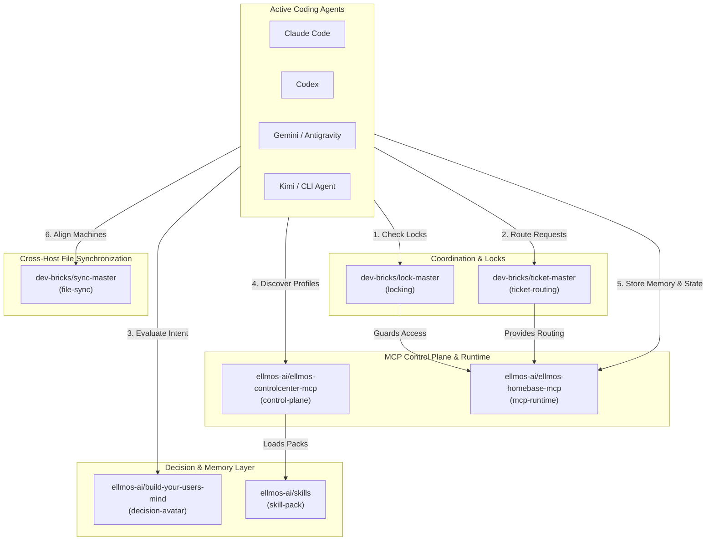
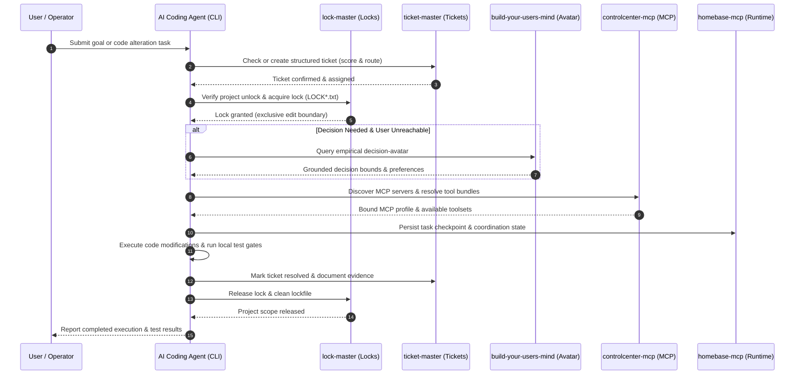

<p align="center">
  <a href="https://github.com/ellmos-ai/agent-ops-stack"></a>
  <a href="https://github.com/ellmos-ai/agent-ops-stack"></a>
  <a href="https://github.com/ellmos-ai/agent-ops-stack/actions/workflows/ci.yml"></a>
  <a href="tests/"></a>
  <a href="agent-ops.manifest.json"></a>
  
  
  
  
  <a href="SECURITY.md"></a>
  <a href="THIRD_PARTY_LICENSES.md"></a>
  <a href="MARKETING-LOG.txt"></a>
  <a href="https://github.com/astral-sh/ruff"></a>
  <a href="LICENSE"></a>
  <a href="https://github.com/ellmos-ai"></a>
  <a href="https://github.com/open-bricks"></a>
  <a href="llms.txt"></a>
</p>

# agent-ops-stack

**🇬🇧 [English version](README.md)**

Eine manifest-getriebene Komposition des lokalen **Agent-Ops**-Ökosystems: die
Koordinationsschicht, die es einem oder mehreren KI-Coding-Agenten (Claude Code, Codex,
Gemini/Antigravity, Kimi oder jedem anderen CLI-Agenten) erlaubt, effektiv und ohne
Rennbedingungen auf derselben Entwickler-Maschine zusammenzuarbeiten, Aufgaben deterministisch
zu routen, in Abwesenheit des menschlichen Operators fundierte Entscheidungen zu treffen
und Multi-Device-Workflows sicher abzugleichen.

Dieses Repository ist Komposition und Dokumentation, kein monolithischer Quellcode: Es listet
sieben fokussierte, eigenständig gepflegte Module in [`agent-ops.manifest.json`](agent-ops.manifest.json)
auf und liefert einen schlanken Installer ([`install.sh`](install.sh)), der ihre Verdrahtung
klont und visualisiert. Siehe [ellmos-ai/stacks](https://github.com/ellmos-ai/stacks) für
die gemeinsame Stack-Manifest-Spezifikation und den Katalog aller Stacks.

Maschinenlesbarer Kontext für LLMs und agentische Coding-Tools: [`llms.txt`](llms.txt).

> [!NOTE]
> **KI-Agenten- & LLM-Kontext**: Dieses Repository bietet strukturierten, maschinenlesbaren Kontext via [`llms.txt`](llms.txt). Autonome CLI-Agenten (Claude Code, Codex, Gemini/Antigravity, Kimi) können diese manifest-gesteuerte Komposition parsen, um lokale Koordination, Sperren, Ticket-Routing, Entscheidungs-Avatare und MCP-Server-Steuerungsebenen zu verstehen.

---

### Schnellnavigation

1. [Überblick & Architektur](#1-ueberblick--architektur)
2. [Was ist Agent-Ops?](#2-was-ist-agent-ops)
3. [Zielgruppen & Auffindbarkeit](#3-zielgruppen--auffindbarkeit)
4. [Vergleichsmatrix gegenüber Alternativen](#4-vergleichsmatrix-gegenueber-alternativen)
5. [Komponierte Module (Die 7 Säulen)](#5-komponierte-module-die-7-saeulen)
6. [Systemarchitektur-Flussdiagramm](#6-systemarchitektur-flussdiagramm)
7. [Multi-Agenten-Lebenszyklus-Sequenz](#7-multi-agenten-lebenszyklus-sequenz)
8. [Governance- & Laufzeit-Invarianten](#8-governance--laufzeit-invarianten)
9. [Wie ein Agent diesen Stack nutzt](#9-wie-ein-agent-diesen-stack-nutzt)
10. [Schnellstart & Installation](#10-schnellstart--installation)
11. [Manifest-Schema-Spezifikation](#11-manifest-schema-spezifikation)
12. [Geschwister-Ökosystem & Integrationsmatrix](#12-geschwister-oekosystem--integrationsmatrix)
13. [Suche, SEO & Begriffsklärung](#13-suche-seo--begriffsklaerung)
14. [Sicherheitsmodell & Bedrohungsabwehr](#14-sicherheitsmodell--bedrohungsabwehr)
15. [Drittanbieter-Lizenzen & Transparenz](#15-drittanbieter-lizenzen--transparenz)
16. [Verifikation & Automatisierte Testsuite](#16-verifikation--automatisierte-testsuite)
17. [Sicherheitsrichtlinie & SLAs](#17-sicherheitsrichtlinie--slas)
18. [Lizenz & Haftung / Liability](#18-lizenz--haftung--liability)

---

<a id="1-ueberblick--architektur"></a>
<a id="ueberblick--architektur"></a>
<a id="1-overview--architecture"></a>
<a id="overview--architecture"></a>
<a id="1-architektur--überblick"></a>
<a id="architektur--überblick"></a>
## 1. Überblick & Architektur

Wenn mehrere autonome oder interaktive CLI-Coding-Agenten gleichzeitig auf dem lokalen System
eines Entwicklers arbeiten, fehlen Standard-Dateisystemen native Nebenläufigkeitskontrollen,
gemeinsame Aufgabenregister und sitzungsübergreifende Gedächtnisse. `agent-ops-stack` bündelt
die unverzichtbaren lokalen Werkzeuge in einem kohärenten, deklarativen Stack:

| Dimension | Spezifikation |
|:---|:---|
| **Manifest-Schema** | `ellmos-stack-manifest-v1` ([`agent-ops.manifest.json`](agent-ops.manifest.json)) |
| **Komponierte Säulen** | 7 spezialisierte Module für Koordination, Sync, Entscheidungen, Skills und MCP |
| **Netzwerk-Profil** | 100% Local-First & Zero Egress (vollständig offline, keine externe Telemetrie) |
| **Rechte-Modell** | Unprivilegierter User-Mode (Non-Elevation; keinerlei Root-/Admin-Rechte erforderlich) |
| **Ziel-Laufzeit** | Linux, macOS und Microsoft Windows (vollständige plattformübergreifende Parität) |
| **Agenten-Unterstützung** | Claude Code, OpenAI Codex, Google Antigravity / Gemini, Moonshot Kimi, CLI-Agenten |

```
dein KI-Coding-Agent
├── MCP-Zugänge (direkter stdio-Kontakt)
│   ├── controlcenter-mcp   → control-plane (nutzt: skill-pack)
│   └── homebase-mcp        → mcp-runtime, memory-facade, task-facade (nutzt: locking, ticket-routing)
└── datei-/protokollbasierte Konventionen (Agent liest & befolgt direkt)
    ├── ticket-master           → ticket-routing
    ├── lock-master             → locking
    ├── sync-master             → file-sync
    ├── build-your-users-mind   → decision-avatar (nutzt: interaction-logs)
    └── skills                  → skill-pack
```

---

<a id="2-was-ist-agent-ops"></a>
<a id="was-ist-agent-ops"></a>
<a id="2-what-is-agent-ops"></a>
<a id="what-is-agent-ops"></a>
## 2. Was ist Agent-Ops?

Jeder KI-Coding-Agent, der auf dem lokalen System des Nutzers operiert, stößt wiederholt auf
dieselben Fragestellungen, bevor er Quellcodedateien modifiziert:
- *Bearbeitet gerade ein anderer Agent oder eine Automation denselben Arbeitsbereich?*
- *Wo werden entdeckte Fehler, Änderungswünsche oder Teilaufgaben nachvollziehbar erfasst und geroutet?*
- *Wie würde der menschliche Operator bei unklaren Architekturentscheidungen in seiner Abwesenheit entscheiden?*
- *Welche wiederverwendbaren Skills, Workflows oder MCP-Server-Bündel stehen bereit?*
- *Wie werden Dateiänderungen über mehrere Rechner synchronisiert, ohne lokale Git-Locks zu beschädigen?*

`agent-ops-stack` löst diese Herausforderungen mit sieben fokussierten, zusammensetzbaren
Modulen statt eines monolithischen Frameworks. Jedes Modul ist unabhängig nutzbar und versioniert,
jedoch über deklarative Schnittstellen harmonisiert.

---

<a id="3-zielgruppen--auffindbarkeit"></a>
<a id="zielgruppen--auffindbarkeit"></a>
<a id="3-target-personas--discoverability"></a>
<a id="target-personas--discoverability"></a>
## 3. Zielgruppen & Auffindbarkeit

`agent-ops-stack` wurde gezielt für vier Haupt-Zielgruppen und Entwickler-Profile entwickelt:

- **`[PERSONA-01]` Entwickler autonomer KI-Agenten-Frameworks & Multi-Agenten-Schwärme**:
  Entwickler, die mehrere autonome CLI-Coding-Agenten (Claude Code, OpenAI Codex, Google Antigravity / Gemini, Moonshot Kimi) auf gemeinsamen lokalen Arbeitsbereichen betreiben und ausfallsichere Dateisperren (`lock-master`) sowie strukturiertes Ticket-Routing (`ticket-master`) benötigen, um Schreibkollisionen und Rennbedingungen zu verhindern.
- **`[PERSONA-02]` Multi-Host- & Edge-Infrastruktur-Entwickler**:
  Ingenieure, die flexibel zwischen Workstations, Laptops und Remote-Servern wechseln und slot-gesteuerte Dateisynchronisation (`sync-master`) benötigen, um Projektdateien ohne Git-Index-Korruption, Split-Brain-Konflikte oder Cloud-Sperren abzugleichen.
- **`[PERSONA-03]` Solo-Entwickler & Tool-Builder**:
  Einzelentwickler, die eine schlanke, nicht-monolithische Infrastruktur für Aufgaben-Backlogs, Problem-Routing und einen empirischen Entscheidungs-Avatar (`build-your-users-mind`) suchen, der bei Abwesenheit des Nutzers fundierte Architekturentscheidungen trifft.
- **`[PERSONA-04]` Enterprise Tooling-, Sicherheits- & Governance-Beauftragte**:
  Verantwortliche, die strikte 100% Offline- und Local-First-Betriebsmodelle mit Zero-Egress, unprivilegierten User-Mode (`RunAsInvoker`), auditierte Drittanbieter-Lizenzen und eine verbindliche 48-Stunden-Sicherheits-SLA vorschreiben.

### Suchbegriffe & Auffindbarkeit (High-Intent SEO)

| Suchkategorie | Englisches Suchziel | Deutsches Suchziel |
|:---|:---|:---|
| **Primäre Architektur** | `local-first multi-agent coordination stack` | `lokaler Multi-Agenten Koordinations-Stack` |
| **Nebenläufigkeit & Sperren** | `CLI coding agent file locking and ticket routing` | `Dateisperren und Ticket-Routing für KI Coding Agenten` |
| **Agenten-Interoperabilität** | `Claude Code Codex Gemini Kimi local coordination` | `lokale Koordination Claude Codex Antigravity Kimi` |
| **Steuerungsebene & MCP** | `MCP control plane for local AI agents` | `MCP Steuerebene für lokale Entwickler-Agenten` |
| **Zero Egress & Sicherheit** | `offline zero-egress agent harness` | `Zero-Egress Multi-Agenten Kollisionsschutz` |
| **Manifest-Komposition** | `declarative agent ops manifest schema` | `deklaratives Agent-Ops Manifest Schema` |

---

<a id="4-vergleichsmatrix-gegenueber-alternativen"></a>
<a id="vergleichsmatrix-gegenueber-alternativen"></a>
<a id="4-comparative-matrix-vs-alternatives"></a>
<a id="comparative-matrix-vs-alternatives"></a>
## 4. Vergleichsmatrix gegenüber Alternativen

Die folgende Matrix vergleicht `agent-ops-stack` mit vier typischen Industrie- und Entwicklungs-Alternativen über 10 zentrale Architektur- und Governance-Dimensionen:

1. **Cloud SaaS Observability**: Gehostete Monitoring- und Telemetrie-Plattformen (z. B. AgentOps.ai, LangSmith, Helicone).
2. **Monolithische Agenten-Frameworks**: Schwere Multi-Agenten-Laufzeitumgebungen (z. B. AutoGen Studio, CrewAI Enterprise, LangGraph Cloud).
3. **Ad-hoc Shell-Skripte & Worktrees**: Manuelle Git-Worktrees, rohe Bash-Skripte und unkoordinierte Dateisystem-Eingriffe.
4. **Klassische Message-Broker**: Schwere Hintergrund-Dienste (z. B. RabbitMQ, Redis Pub/Sub, Celery).

| Dimension & Invariante | agent-ops-stack | Cloud SaaS Observability | Monolithische Frameworks | Ad-hoc Skripte / Worktrees | Klassische Broker |
|:---|:---:|:---:|:---:|:---:|:---:|
| **1. 100% Local-First & Zero Egress** (`INV-LOCAL-01`) | **Ja (Vollständig Lokal)** | Nein (Cloud-Egress Zwang) | Teilweise (Oft Telemetrie) | Ja (Nur Lokal) | Teilweise (Netzwerk-Ports) |
| **2. Unprivilegierter User-Mode** (`INV-USER-02`) | **Ja (`RunAsInvoker`)** | Ja (Client-API) | Oft Daemon- / Docker-Bedarf | Ja (Standardnutzer) | Nein (Dienst- / Root-Rechte) |
| **3. Fail-Closed Dateisperren** (`INV-LOCK-03`) | **Ja (`lock-master`)** | Nein (Nur Beobachtung) | Proprietär im Speicher | Nein (Blindes Überschreiben) | Nein (Benötigt Adapter) |
| **4. Strukturiertes Ticket-Routing** (`INV-ROUT-04`) | **Ja (`ticket-master`)** | Nein (Nur Traces) | Ad-hoc Aufgabenketten | Nein (Ungetrackte Änderungen) | Nur rohe Payloads |
| **5. Entscheidungs-Avatar & Theory-of-Mind** (`INV-AVAT-05`)| **Ja (`build-your-users-mind`)**| Nein (Kein Nutzermodell) | Nein (Statische Prompts) | Nein (Manuelle Intervention) | Nein (Inhaltsagnostisch) |
| **6. Deklaratives Manifest-Blueprint** (`INV-MANI-06`) | **Ja (`ellmos-stack-manifest-v1`)**| Proprietäres Cloud-Schema | Komplexe Python-DSLs | Keine (Hardcodierte Pfade) | Komplexe Broker-Configs |
| **7. Immutable Release-Tag-Pinning** (`INV-PIN-07`) | **Ja (Release-Tags)** | SaaS-gesteuerte Updates | Häufige Breaking Changes | Keine (Unversionierte Skripte) | Paket-Manager getrieben |
| **8. Sandboxed Installer-Grenze** (`INV-SAND-08`) | **Ja (Isoliertes `./modules/`)**| Binäre Remote-Agenten | Systemweites pip / npm | Wildwuchs im Dateisystem | System-Dienste / Daemons |
| **9. Slot-gesteuerter Multi-Host-Sync** (`INV-SYNC-09`) | **Ja (`sync-master`)** | Cloud Vendor Lock-In | Meist Einzelsystem | Hohe Sync-Konfliktgefahr | Cluster-Infrastruktur nötig |
| **10. 48h Sicherheits- & Triage-SLA** (`INV-SLA-10`) | **Ja (Verbindliche 48h/5d SLA)** | Standard SaaS-Bedingungen | Best-Effort Community | Keine SLA / Ungepflegt | Upstream-Hersteller SLA |

---

<a id="5-komponierte-module-die-7-saeulen"></a>
<a id="komponierte-module-die-7-saeulen"></a>
<a id="5-composed-modules-the-7-pillars"></a>
<a id="composed-modules-the-7-pillars"></a>
<a id="3-komponierte-module-die-7-säulen"></a>
## 5. Komponierte Module (Die 7 Säulen)

| Modul | Rolle | Liefert (`provides`) | Nutzt (`consumes`) | Repository |
|:---|:---|:---|:---|:---|
| **ticket-master** | Plattformübergreifende Workflow-Engine: Erfasst Problembeschreibungen, bewertet Prioritäten und routet Tickets an die zuständigen Repositories oder Delegaten | `ticket-routing` | — | [dev-bricks/ticket-master](https://github.com/dev-bricks/ticket-master) |
| **lock-master** | Abhängigkeitsfreies Datei-Sperrsystem (`LOCK*.txt`): Signalisiert Projektbenutzung, um nebenläufige Schreibkonflikte zuverlässig zu verhindern | `locking` | — | [dev-bricks/lock-master](https://github.com/dev-bricks/lock-master) |
| **sync-master** | Serverlose Datei-Synchronisation: Verwaltet Rechner-Slots und tägliche Abgleichs-Rituale über Multi-Geräte-Setups | `file-sync` | — | [dev-bricks/sync-master](https://github.com/dev-bricks/sync-master) |
| **build-your-users-mind** | Empirischer Nutzer-Entscheidungsavatar: Baut aus Interaktionslogs ein Theory-of-Mind-Modell auf, um bei Abwesenheit im Sinne des Nutzers zu entscheiden | `decision-avatar` | `interaction-logs` | [ellmos-ai/build-your-users-mind](https://github.com/ellmos-ai/build-your-users-mind) |
| **skills** | Portable KI-Skill-Bibliothek im Anthropic-`SKILL.md`-Format: Eigenständige Prozess-Skills, Entwickler-Workflows und Utility-Tools | `skill-pack` | — | [ellmos-ai/skills](https://github.com/ellmos-ai/skills) |
| **controlcenter-mcp** | MCP-Steuerebene: Erkennt lokale MCP-Server, liest Profil-Dateien, bildet Fähigkeitsbündel und empfiehlt Werkzeugkonfigurationen | `control-plane` | `skill-pack` | [ellmos-ai/ellmos-controlcenter-mcp](https://github.com/ellmos-ai/ellmos-controlcenter-mcp) |
| **homebase-mcp** | Local-First-MCP-Server für gemeinsamen Zustand, Wissensspeicher, Routing und Task-Fassade über kanonischen lokalen Speichern | `mcp-runtime`, `memory-facade`, `task-facade` | `locking`, `ticket-routing` | [ellmos-ai/ellmos-homebase-mcp](https://github.com/ellmos-ai/ellmos-homebase-mcp) |

---

<a id="6-systemarchitektur-flussdiagramm"></a>
<a id="systemarchitektur-flussdiagramm"></a>
<a id="6-system-architecture-flowchart"></a>
<a id="system-architecture-flowchart"></a>
<a id="4-systemarchitektur-flussdiagramm"></a>
## 6. Systemarchitektur-Flussdiagramm

Das folgende interaktive Mermaid-Flussdiagramm visualisiert die funktionale Schichtenarchitektur
der sieben Module im Zusammenspiel mit den aktiven Coding-Agenten:



---

<a id="7-multi-agenten-lebenszyklus-sequenz"></a>
<a id="multi-agenten-lebenszyklus-sequenz"></a>
<a id="7-multi-agent-operational-lifecycle-sequence"></a>
<a id="multi-agent-operational-lifecycle-sequence"></a>
<a id="5-multi-agenten-lebenszyklus-sequenz"></a>
## 7. Multi-Agenten-Lebenszyklus-Sequenz

Das folgende Sequenzdiagramm zeigt den vollständigen Lebenszyklus eines agentischen
Coding-Auftrags innerhalb des `agent-ops-stack`-Ablaufs:



---

<a id="8-governance--laufzeit-invarianten"></a>
<a id="governance--laufzeit-invarianten"></a>
<a id="8-governance--runtime-invariants"></a>
<a id="governance--runtime-invariants"></a>
<a id="6-governance--laufzeit-invarianten"></a>
## 8. Governance- & Laufzeit-Invarianten

Die Architektur von `agent-ops-stack` unterliegt zehn unveränderlichen Governance- und
Sicherheitsinvarianten, um Arbeitsbereiche vor Beschädigung und unkontrollierten Aktionen zu schützen:

| ID | Governance-Invariante | Betriebsvorschrift | Fehlerzustands-Garantie |
|:---:|:---|:---|:---|
| **01** | **100% Local-First & Zero Egress** (`INV-LOCAL-01`) | Sämtliche Koordination, Manifeste und Tools laufen strikt lokal und offline. | Keinerlei Telemetrie, Tracking oder externe API-Übertragungen. |
| **02** | **Unprivilegierter User-Mode** (`INV-USER-02`) | Skripte, Installer und Agentenroutinen laufen ausschließlich mit Standardrechten. | Admin- oder Root-Rechte werden niemals angefordert oder benötigt. |
| **03** | **Fail-Closed Dateisperren-Integrität** (`INV-LOCK-03`) | Agenten müssen vor Schreibaktionen `lock-master` `LOCK*.txt` prüfen und achten. | Bei aktiver Sperre stoppen mutierende Aktionen sofort fail-closed. |
| **04** | **Strukturiertes Ticket-Routing** (`INV-ROUT-04`) | Offene Aufgaben und Fehler müssen über `ticket-master` erfasst werden. | Verhindert unkoordinierte und ungetrackte Codeänderungen. |
| **05** | **Empirischer Entscheidungs-Avatar** (`INV-AVAT-05`) | Bei Abwesenheit des Nutzers konsultiert der Agent `build-your-users-mind`. | Verhindert spekulative Mutmaßungen und unerwünschte Abweichungen. |
| **06** | **Deterministischer Manifest-Bauplan** (`INV-MANI-06`) | Die Komposition wird ausnahmslos durch `agent-ops.manifest.json` definiert. | Keine impliziten Abhängigkeiten; Installer arbeitet rein deklarativ. |
| **07** | **Unveränderliche Release-Tag-Pins** (`INV-PIN-07`) | Manifest-Quellen referenzieren feste Release-Tags (`v1.11.3`, `v2026.09.03`). | Schließt Upstream-Drift und unvorhersehbare Versionsbrüche aus. |
| **08** | **Isolierte Installer-Grenzen** (`INV-SAND-08`) | `install.sh` klont Module ausschließlich in das git-ignorierte `./modules/`. | Keine unbemerkte Modifikation globaler Nutzer- oder Agenten-Configs. |
| **09** | **Multi-Host Slot-Isolation** (`INV-SYNC-09`) | `sync-master` weist dedizierte Rechner-Slots für den Cloud-Abgleich zu. | Verhindert Split-Brain-Kollisionen und nebenläufige Überschreibungen. |
| **10** | **48h Sicherheits- & Triage-SLA** (`INV-SLA-10`) | Sicherheitsmeldungen unterliegen verbindlichen Reaktionsfristen. | Erstreaktion innerhalb 48h; Triage innerhalb von 5 Werktagen. |

---

<a id="9-wie-ein-agent-diesen-stack-nutzt"></a>
<a id="wie-ein-agent-diesen-stack-nutzt"></a>
<a id="9-how-an-agent-uses-this-stack"></a>
<a id="how-an-agent-uses-this-stack"></a>
<a id="7-wie-ein-agent-diesen-stack-nutzt"></a>
## 9. Wie ein Agent diesen Stack nutzt

Beim Start einer Arbeitssitzung in einem neuen oder bestehenden Projekt folgt der Agent
diesem standardisierten Ablauf:

1. **Vor jeder Dateiänderung:** Prüfe über `lock-master` auf aktive `LOCK*.txt`-Dateien. Bei bestehender Sperre bleibt der Bereich strikt schreibgeschützt.
2. **Rechte & Richtlinien:** Falls das Projekt ein Rechteprofil definiert, prüfe geplante Operationen gegen die deklarierten Erlaubnisse.
3. **Entscheidungen bei Unsicherheit:** Ist der Nutzer abwesend und eine Entwurfsentscheidung erforderlich, frage `build-your-users-mind` nach empirischer Orientierung.
4. **Aufgaben erfassen & routen:** Dokumentiere Bugs, Feature-Wünsche oder delegierte Aufgaben über `ticket-master`, um Transparenz zu wahren.
5. **Skill-Wahl & MCP-Konfiguration:** Prüfe `skills` auf bewährte Arbeitsabläufe; wähle über `controlcenter-mcp` passende Werkzeugbündel; sichere Zustände via `homebase-mcp`.
6. **Geräteübergreifender Abgleich:** Beachte bei Multi-Device-Umgebungen die Slot-Regeln und täglichen Sync-Routinen von `sync-master` vor dem Pushen.

> [!TIP]
> **Multi-Agenten-Koordinations-Praxis**: Führe vor Codeänderungen in geteilten Repositories stets eine `lock-master`-Prüfung durch und nutze `ticket-master` zur strukturierten Weitergabe offener Aufgaben an andere Agenten oder den Nutzer.

---

<a id="10-schnellstart--installation"></a>
<a id="schnellstart--installation"></a>
<a id="10-quickstart--installation"></a>
<a id="quickstart--installation"></a>
<a id="8-schnellstart--installation"></a>
## 10. Schnellstart & Installation

Klone `agent-ops-stack` und starte das Installationsskript, um die lokalen Module einzurichten:

```bash
# 1. Kompositions-Repository klonen
git clone https://github.com/ellmos-ai/agent-ops-stack.git
cd agent-ops-stack

# 2. Deklarativen Installer ausführen (klont Module nach ./modules/)
./install.sh

# 3. Optional: Zielverzeichnis explizit übergeben
./install.sh mein-zielverzeichnis
```

`install.sh` liest [`agent-ops.manifest.json`](agent-ops.manifest.json), klont die sieben
Repositories und gibt eine Übersicht aller gelieferten (`provides`) und benötigten
(`consumes`) Fähigkeiten aus. Es nimmt keine systemweiten Eingriffe vor.

---

<a id="11-manifest-schema-spezifikation"></a>
<a id="manifest-schema-spezifikation"></a>
<a id="11-manifest-schema-specification"></a>
<a id="manifest-schema-specification"></a>
<a id="9-manifest-schema-spezifikation"></a>
## 11. Manifest-Schema-Spezifikation

[`agent-ops.manifest.json`](agent-ops.manifest.json) folgt der `ellmos-stack-manifest-v1`-Spezifikation:

```json
{
  "schema": "ellmos-stack-manifest-v1",
  "name": "agent-ops-stack",
  "description": "Local-first coordination layer for one or more CLI coding agents...",
  "modules": [
    {
      "name": "ticket-master",
      "source": { "type": "github", "repo": "dev-bricks/ticket-master", "ref": "v1.11.3" },
      "kind": "coordination",
      "boundaries": { "net": "none", "paths": ["./"], "tools": [] },
      "wiring": { "provides": ["ticket-routing"], "consumes": [] }
    }
  ]
}
```

- `schema`: Kennzeichnet die Spezifikationsversion (`ellmos-stack-manifest-v1`).
- `modules`: Liste der Moduldefinitionen mit Git-Quelle, Typ und Sicherheitsgrenzen.
- `boundaries`: Harte Restriktionen bezüglich Netzwerkzugriff, Pfadreichweite und Werkzeugen.
- `wiring`: Deklariert bereitgestellte Fähigkeiten (`provides`) und Abhängigkeiten (`consumes`).

---

<a id="12-geschwister-oekosystem--integrationsmatrix"></a>
<a id="geschwister-oekosystem--integrationsmatrix"></a>
<a id="12-sibling-ecosystem--cross-integration-matrix"></a>
<a id="sibling-ecosystem--cross-integration-matrix"></a>
<a id="10-geschwister-oekosystem--integrationsmatrix"></a>
<a id="10-geschwister-ökosystem--integrationsmatrix"></a>
## 12. Geschwister-Ökosystem & Integrationsmatrix

`agent-ops-stack` verbindet die Koordinations- und Entwicklungsbausteine der Ökosysteme
`ellmos-ai`, `dev-bricks` und `open-bricks`:

| Repository | Organisation | Rolle im Ökosystem & Integration |
|:---|:---|:---|
| [dev-bricks/ticket-master](https://github.com/dev-bricks/ticket-master) | `dev-bricks` | Position-0 Ticket-Erfassung, Scoring und aufgabenbezogenes Routing |
| [dev-bricks/lock-master](https://github.com/dev-bricks/lock-master) | `dev-bricks` | Datei-Sperrsystem (`LOCK*.txt`), Rechte-Evaluation und Kollisionsschutz |
| [dev-bricks/sync-master](https://github.com/dev-bricks/sync-master) | `dev-bricks` | Rechner-Slot-Synchronisation und gated tägliche Sync-Rituale |
| [ellmos-ai/build-your-users-mind](https://github.com/ellmos-ai/build-your-users-mind) | `ellmos-ai` | Empirischer Entscheidungs-Avatar auf Basis realer Interaktionshistorie |
| [ellmos-ai/skills](https://github.com/ellmos-ai/skills) | `ellmos-ai` | Portable Skill-Bibliothek im standardisierten `SKILL.md`-Format |
| [ellmos-ai/ellmos-controlcenter-mcp](https://github.com/ellmos-ai/ellmos-controlcenter-mcp) | `ellmos-ai` | MCP-Steuerebene, Server-Erkennung und Werkzeug-Fähigkeitsbündel |
| [ellmos-ai/ellmos-homebase-mcp](https://github.com/ellmos-ai/ellmos-homebase-mcp) | `ellmos-ai` | Geteilter Zustand, Gedächtnis-Fassade und Koordinationslaufzeit |
| [ellmos-ai/stacks](https://github.com/ellmos-ai/stacks) | `ellmos-ai` | Gemeinsame Stack-Manifest-Schemas, Prüfwerkzeuge und Stack-Katalog |
| [ellmos-ai/convergence-reconciler](https://github.com/ellmos-ai/convergence-reconciler) | `ellmos-ai` | Reziproke Code-Evaluation, Variantenverpflanzung und Pareto-Fitness |
| [ellmos-ai/ellmos-chat](https://github.com/ellmos-ai/ellmos-chat) | `ellmos-ai` | Local-First Chat- und Agenten-Orchestrierungsoberfläche |
| [dev-bricks/CareCenter-for-Codex](https://github.com/dev-bricks/CareCenter-for-Codex) | `dev-bricks` | Hintergrundwartung, Zustandsmonitoring und SQLite-Optimierung |
| [open-bricks/open-bricks](https://github.com/open-bricks/open-bricks) | `open-bricks` | Dachorganisation für quelloffene Entwicklerwerkzeuge und Standards |

---

<a id="13-suche-seo--begriffsklaerung"></a>
<a id="suche-seo--begriffsklaerung"></a>
<a id="13-search-seo--disambiguation"></a>
<a id="search-seo--disambiguation"></a>
<a id="11-suche--begriffsklaerung"></a>
<a id="11-suche--begriffsklärung"></a>
## 13. Suche, SEO & Begriffsklärung

- **Kanonische Identität**: `ellmos-ai/agent-ops-stack` ist ein deklarativer, lokaler Koordinations-Stack für Multi-Agenten-Workflows (Dateisperren, Ticket-Routing, Entscheidungsavatar, Skills, MCP-Steuerebene).
- **Begriffsklärung**: Nicht verwandt mit Cloud-Observability-SaaS-Produkten (wie AgentOps.ai), generischen AgentStack-Templates oder externen LLMOps-Servern.
- **Suchbegriffe**: `ellmos-ai agent-ops-stack`, `local CLI agent coordination stack`, `MCP control plane for coding agents`, `manifest-driven agent ops stack`, `lock-master ticket-master sync-master stack`, `Zero-Egress Multi-Agenten Kollisionsschutz`, `lokale Koordination Claude Codex Antigravity Kimi`.

---

<a id="14-sicherheitsmodell--bedrohungsabwehr"></a>
<a id="sicherheitsmodell--bedrohungsabwehr"></a>
<a id="14-security-model--threat-mitigation"></a>
<a id="security-model--threat-mitigation"></a>
## 14. Sicherheitsmodell & Bedrohungsabwehr

`agent-ops-stack` basiert auf einem mehrschichtigen Sicherheitsmodell ("Defense-in-Depth"), das speziell auf autonome Entwicklungsumgebungen ausgelegt ist:

- **Strikte Local-First-Grenze (`INV-LOCAL-01`)**: Alle Aktionen, Manifeste und Koordinationsschritte verbleiben vollständig auf dem lokalen Dateisystem. Es werden weder Netzwerk-Sockets geöffnet noch Telemetriedaten übertragen oder externe Zugangsdaten gespeichert.
- **Unprivilegierte RunAsInvoker-Ausführung (`INV-USER-02`)**: Sämtliche Skripte (`install.sh`, Tests, Validierungsroutinen) laufen ausschließlich unter normalen Benutzerrechten ohne Admin- oder Root-Elevation.
- **Fail-Closed Sperrmechanismen gegen Schreibkollisionen (`INV-LOCK-03`)**: Durch `lock-master` gesetzte Dateisperren stoppen schreibende Agenten-Aktionen sofort und verhindern korrupte Code-Stände durch parallele Bearbeitungen.
- **Isolierte Modul-Sandbox (`INV-SAND-08`)**: Der deklarative Installer klont Drittmodule ausschließlich in das lokale, git-ignorierte Verzeichnis `./modules/`, wodurch globale Python-Umgebungen und Systempfade unberührt bleiben.
- **Verbindliche Triage-SLA (`INV-SLA-10`)**: Wir garantieren eine Rückmeldung innerhalb von 48 Stunden sowie eine strukturierte Sicherheitsbewertung binnen 5 Werktagen.

---

<a id="15-drittanbieter-lizenzen--transparenz"></a>
<a id="drittanbieter-lizenzen--transparenz"></a>
<a id="15-third-party-licenses--transparency"></a>
<a id="third-party-licenses--transparency"></a>
<a id="13-drittanbieter-lizenzen--transparenz"></a>
## 15. Drittanbieter-Lizenzen & Transparenz

`agent-ops-stack` führt ein vollständiges, auditierbares Inventar aller Laufzeit-, Entwicklungs- und Werkzeug-Abhängigkeiten in [`THIRD_PARTY_LICENSES.md`](THIRD_PARTY_LICENSES.md).

| Kategorie | Komponente / Abhängigkeit | Lizenz | Richtlinie / Schutzgrenze |
|:---|:---|:---|:---|
| **Laufzeit & Core** | Python Standardbibliothek (`json`, `re`, `pathlib`, `tomllib`, `typing`) | PSFL-2.0 | 100% Offline, Zero-Egress |
| **Paketierung & Build** | `setuptools >= 61.0` | MIT | Lokales Paketierungs-Backend |
| **Test & Verträge** | `pytest >= 7.0.0` | MIT | Automatisiertes Vertragstest-Harness |
| **Linting & Hygiene** | `ruff >= 0.1.0` | MIT / Apache-2.0 | Schnelle statische Analyse und Formatierung |
| **Shell-Automation** | POSIX Shell (`install.sh`) / `git` / `jq` | System / GPL / MIT | Unprivilegiertes Klonen von Repositories |

Alle Abhängigkeiten sind strikt permissiv und entsprechen den lokalen Zero-Egress-Laufzeitgarantien des Projekts.

---

<a id="16-verifikation--automatisierte-testsuite"></a>
<a id="verifikation--automatisierte-testsuite"></a>
<a id="16-verification--automated-test-suite"></a>
<a id="verification--automated-test-suite"></a>
<a id="12-sicherheit--verifikation"></a>
## 16. Verifikation & Automatisierte Testsuite

`agent-ops-stack` erzwingt standardisierte statische Analysen und automatisierte Vertragstests:

```bash
# 1. Automatisierte Metadaten-, Schema- und Vertragstests ausführen (31 Tests bestanden | 100% grün)
pytest -v

# 2. Linter-Standards prüfen
ruff check .

# 3. Shell-Skript-Syntax prüfen
bash -n install.sh

# 4. Manifest-JSON validieren
python -c "import json; json.load(open('agent-ops.manifest.json', encoding='utf-8'))"
```

Ausführliche Richtlinien zur Meldung von Sicherheitsbedenken finden sich in [`SECURITY.md`](SECURITY.md).

---

<a id="17-sicherheitsrichtlinie--slas"></a>
<a id="sicherheitsrichtlinie--slas"></a>
<a id="17-security-policy--slas"></a>
<a id="security-policy--slas"></a>
## 17. Sicherheitsrichtlinie & SLAs

Verbindliche Richtlinien zur Offenlegung von Schwachstellen, koordinierte Sicherheitsberichte und Reaktionsfristen finden sich in [`SECURITY.md`](SECURITY.md):
- **Erstreaktions-SLA**: Innerhalb von 48 Stunden.
- **Triage-SLA**: Innerhalb von 5 Werktagen.
- **Sicherheits-Advisories**: Koordiniert über [GitHub Security Advisories](https://github.com/ellmos-ai/agent-ops-stack/security/advisories).

---

<a id="18-lizenz--haftung--liability"></a>
<a id="lizenz--haftung--liability"></a>
<a id="18-license--liability--haftung"></a>
<a id="license--liability--haftung"></a>
<a id="14-lizenz"></a>
<a id="15-haftung--liability"></a>
## 18. Lizenz & Haftung / Liability

Dieses Repository steht unter der permissiven **MIT-Lizenz**. Siehe [`LICENSE`](LICENSE). Jedes komponierte Modul unterliegt seiner eigenen Open-Source-Lizenz.

Dieses Projekt ist eine **unentgeltliche Open-Source-Schenkung** im Sinne der §§ 516 ff. BGB. Die Haftung des Urhebers ist gemäß **§ 521 BGB** auf **Vorsatz und grobe Fahrlässigkeit** beschränkt. Die komponierten Module unterliegen jeweils ihrer eigenen Lizenz (siehe verlinkte Repositories).
