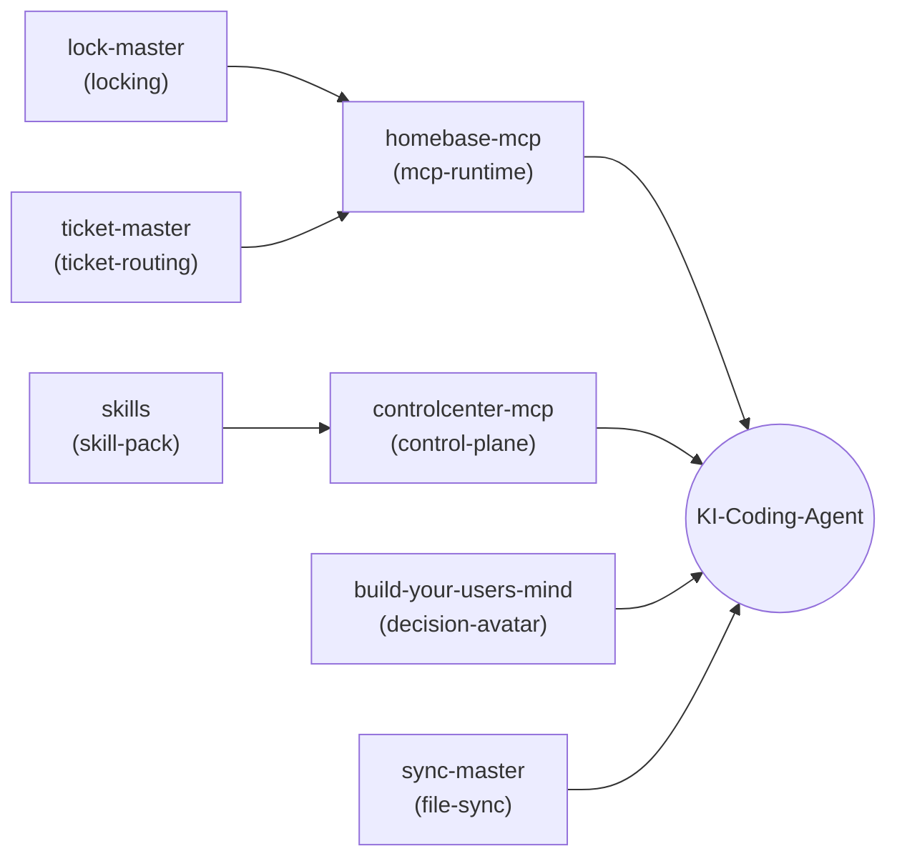

# agent-ops-stack

**🇬🇧 [English version](README.md)**

Eine manifest-getriebene Komposition des lokalen **Agent-Ops**-Ökosystems: die
Koordinationsschicht, die es einem oder mehreren KI-Coding-Agenten (Claude, Codex,
Gemini/agy, Kimi oder jedem anderen CLI-Agenten) erlaubt, auf derselben Nutzer-Maschine
zu arbeiten, ohne sich gegenseitig ins Gehege zu kommen, zu wissen, wohin Probleme
geroutet werden, und sinnvoll zu handeln, wenn der Nutzer nicht erreichbar ist.

Dieses Repository ist Komposition und Dokumentation, kein Quellcode: Es listet sieben
bestehende, eigenständig publizierbare Module in
[`agent-ops.manifest.json`](agent-ops.manifest.json) auf und liefert einen schlanken
Installer ([`install.sh`](install.sh)), der sie klont und verdrahtet. Kein Modul-Code
wird hier kopiert. Siehe [ellmos-ai/stacks](https://github.com/ellmos-ai/stacks) für
das gemeinsame Manifest-Schema und den Katalog aller Stacks der ellmos-ai-Familie.

Maschinenlesbarer Kontext für LLMs und agentische Coding-Tools: [`llms.txt`](llms.txt).

## Einstieg

| Wenn du brauchst... | Starte mit | Warum |
|---|---|---|
| Einen lokalen Koordinations-Stack für mehrere CLI-Coding-Agenten | [`agent-ops.manifest.json`](agent-ops.manifest.json) | Zeigt die sieben Module, ihre Repositories und die gelieferten Fähigkeiten. |
| Eine schnelle Installation in eine lokale Sandbox | [`install.sh`](install.sh) | Klont die Module nach `./modules/` und gibt die Verdrahtung aus. |
| Das Betriebsmodell vor der Installation | [Wie ein Agent diesen Stack nutzt](#wie-ein-agent-diesen-stack-nutzt) | Beschreibt die Reihenfolge aus Lock, Ticket, Entscheidungs-Avatar, Skill und MCP-Steuerebene. |
| Maschinenlesbaren Projektkontext | [`llms.txt`](llms.txt) | Liefert Crawlers und agentischen Tools Zusammenfassung, Suchphrasen und Grenzen. |

## Was ist Agent-Ops?

Jeder KI-Coding-Agent, der auf dem lokalen System von `<USER>` arbeitet, braucht
wiederholt Antworten auf dieselben Fragen, bevor er irgendetwas anfasst: *Arbeitet
gerade ein anderer Agent in diesem Projekt? Wo melde ich einen Bug oder eine
Änderungsanfrage, damit sie richtig geroutet wird? Was würde `<USER>` hier
entscheiden, wenn er nicht erreichbar ist? Welche gemeinsamen Skills/Workflows
existieren bereits für diese Art Aufgabe, und wie verwalte ich die lokale
MCP-Werkzeugoberfläche, die diese Skills eventuell brauchen?*

Agent-Ops beantwortet diese Fragen mit sieben kleinen, fokussierten Modulen statt einem
großen Framework — jedes für sich nutzbar, hier zu einem Stack komponiert.

## Module

| Modul | Rolle | Liefert (`provides`) | Repository |
|--------|------|----------|-------------|
| **ticket-master** | Plattformübergreifender, Multi-Provider-Workflow/Betriebsmodus: `<USER>` tippt ein Problem in eine offene Agenten-Session ("Position 0"); der Agent erfasst es als strukturiertes Ticket, bewertet es und routet es an das richtige Projekt oder einen Delegaten | `ticket-routing` | [dev-bricks/ticket-master](https://github.com/dev-bricks/ticket-master) |
| **lock-master** | Portables, abhängigkeitsfreies, config-gesteuertes Datei-Sperrsystem (`LOCK*.txt`) für Multi-Agenten-Koordination — signalisiert, welches Projekt/welche Komponente gerade in Benutzung ist, damit kein anderer Agent/keine Automation gleichzeitig eingreift | `locking` | [dev-bricks/lock-master](https://github.com/dev-bricks/lock-master) |
| **sync-master** | Serverloser, cloud-fähiger Sync-„Yard", der mehrere Maschinen und ihre Agenten über einen beliebigen Datei-Sync-Ordner abgeglichen hält (Slot-Regel, gated daily ritual, Bootstrap-Runbook) — macht den Stack multi-maschinen-fähig | `file-sync` | [dev-bricks/sync-master](https://github.com/dev-bricks/sync-master) |
| **build-your-users-mind** | Baut aus den eigenen Interaktionslogs von `<AGENT>` ein empirisches, sich selbst verbesserndes Theory-of-Mind-Modell von `<USER>` auf, damit ein Agent vorhersagen kann, was `<USER>` entscheiden würde, und in seinem Sinne handelt, wenn er abwesend ist | `decision-avatar` | [ellmos-ai/build-your-users-mind](https://github.com/ellmos-ai/build-your-users-mind) |
| **skills** | Portable KI-Skill-Bibliothek im Anthropic-kompatiblen `SKILL.md`-Format: eigenständige Prozess-Skills, Dev-Workflows und Utility-Tools, die jede Agenten-Laufzeitumgebung installieren kann | `skill-pack` | [ellmos-ai/skills](https://github.com/ellmos-ai/skills) |
| **controlcenter-mcp** | MCP-Steuerebene: entdeckt lokale MCP-Server, liest MCP-Profildateien, gruppiert Server in Capability-Bundles, empfiehlt ein Profil für eine Aufgabe | `control-plane` | [ellmos-ai/ellmos-controlcenter-mcp](https://github.com/ellmos-ai/ellmos-controlcenter-mcp) |
| **homebase-mcp** | Local-First-MCP-Server für Memory, Wissen, Routing, Schwarm-Muster und persistenten Zustand — das Modul kann auch als Fassade vor einem bestehenden lokalen Memory-/Task-Speicher stehen statt einer eigenen gebündelten Datenbank | `mcp-runtime`, `memory-facade`, `task-facade` | [ellmos-ai/ellmos-homebase-mcp](https://github.com/ellmos-ai/ellmos-homebase-mcp) |

## Wie die Module zusammenspielen



`homebase-mcp` und `controlcenter-mcp` sind die beiden Module, mit denen ein Agent
direkt spricht (als MCP-Server); `ticket-master`, `lock-master`,
`build-your-users-mind`, `sync-master` und `skills` sind datei-/protokollbasierte Konventionen, die
der Agent direkt liest und befolgt — und die `homebase-mcp`/`controlcenter-mcp`
optional als MCP-Tool-Aufrufe fassadieren können.

Dieselbe Komposition als ASCII-Baum, für Terminals und Klartext-Renderer:

```
dein KI-Coding-Agent
├── MCP-Zugänge (direkter Kontakt)
│   ├── controlcenter-mcp   → control-plane
│   │                          nutzt: skill-pack
│   └── homebase-mcp        → mcp-runtime, memory-facade, task-facade
│                              nutzt: locking, ticket-routing
└── datei-/protokollbasierte Konventionen (Agent liest & befolgt direkt)
    ├── ticket-master           → ticket-routing
    ├── lock-master             → locking
    ├── sync-master             → file-sync
    ├── build-your-users-mind   → decision-avatar
    │                              nutzt: interaction-logs
    └── skills                  → skill-pack
```

## Wie ein Agent diesen Stack nutzt

1. **Vor jeder Änderung an einem Projekt:** auf eine aktive `LOCK*.txt` prüfen
   (lock-master). Respektieren — keinen gesperrten Bereich verändern.
2. **Rechte, sofern deklariert:** definiert ein Projekt eine lock-master-Rechtedatei,
   die beabsichtigte Aktion vor der Ausführung dagegen auswerten.
3. **Entscheidung bei Unklarheit:** ist `<USER>` nicht erreichbar und eine
   Ermessensentscheidung nötig, den Entscheidungs-Avatar (build-your-users-mind)
   konsultieren statt zu raten.
4. **Bugs, Änderungswünsche oder offene Fragen:** über ticket-master einreichen,
   damit sie das richtige Projekt erreichen und an einen passenden Agenten/Delegaten
   geroutet werden.
5. **Werkzeuge und geteiltes Wissen:** den gemeinsamen Skill-Pack (skills) nach einem
   bestehenden Workflow durchsuchen, bevor einer improvisiert wird; controlcenter-mcp
   nutzen, um das richtige MCP-Profil/Bundle für die Aufgabe zu wählen;
   homebase-mcp für gemeinsamen Memory-/Task-Zugriff nutzen, sofern die lokale
   Einrichtung es an einen kanonischen Speicher anbindet.

## Installation

```bash
git clone https://github.com/ellmos-ai/agent-ops-stack.git
cd agent-ops-stack
./install.sh            # klont alle sieben Module nach ./modules/
```

`install.sh` liest nur [`agent-ops.manifest.json`](agent-ops.manifest.json), klont
jedes aufgeführte Modul und gibt eine Verdrahtungs-Zusammenfassung aus — es
registriert **keine** MCP-Server in der Konfiguration des Agenten und deployt keine
Skills in ein Skill-Verzeichnis. Diesen modul-spezifischen Einrichtungsschritt
dokumentiert jeweils das README des Moduls (z. B. `ellmos-homebase-mcp` oder
`ellmos-controlcenter-mcp` beim MCP-Host registrieren, oder einen Skill-Ordner nach
`~/.claude/skills/` kopieren). So bleibt `agent-ops-stack` selbst frei von
agenten-spezifischen Konfigurationsannahmen.

## Manifest-Schema

`agent-ops.manifest.json` folgt `ellmos-stack-manifest-v1`, dokumentiert in
[ellmos-ai/stacks](https://github.com/ellmos-ai/stacks/blob/main/docs/manifest-schema.md).
Ein Modul hinzufügen bedeutet, einen Eintrag in dieser Datei zu ergänzen — keine
Installer-Code-Änderung.

## Warum "agent-ops"

Dies komponiert die **lokale Power-User-Schicht** für CLI-Coding-Agenten
(Koordination, Memory, Entscheidungen, Skills, MCP-Steuerebene) — abzugrenzen von
einem gehosteten Assistenz-Produkt (Chat-UI, RAG, Auth) oder einem serverseitigen
Forschungs-Automatisierungs-Stack wie
[ellmos-ai/ellmos-stack](https://github.com/ellmos-ai/ellmos-stack). Es folgt demselben
"Installation ist der Bauplan"-Manifest-Prinzip, das andernorts im
`ellmos-ai`-Ökosystem genutzt wird.

## Suche und Abgrenzung

`agent-ops-stack` meint den lokalen ellmos-ai-Koordinations-Stack für
CLI-Coding-Agenten: Ticket-Routing, Datei-Locks, Entscheidungs-Avatar, geteilte
Skills und MCP-Steuerebene, komponiert per Manifest. Es ist nicht die AgentOps
Observability-SaaS, nicht AgentStack und keine gehostete LLMOps-Plattform. Nützliche
Suchanker sind `ellmos-ai agent-ops-stack`, `local CLI agent coordination stack`,
`MCP control plane for coding agents` und `manifest-driven agent ops stack`.

## Lizenz

MIT

---

## Haftung / Liability

Dieses Projekt ist eine **unentgeltliche Open-Source-Schenkung** im Sinne der §§ 516 ff. BGB. Die Haftung des Urhebers ist gemäß **§ 521 BGB** auf **Vorsatz und grobe Fahrlässigkeit** beschränkt. Die komponierten Module unterliegen jeweils ihrer eigenen Lizenz (siehe verlinkte Repositories).
